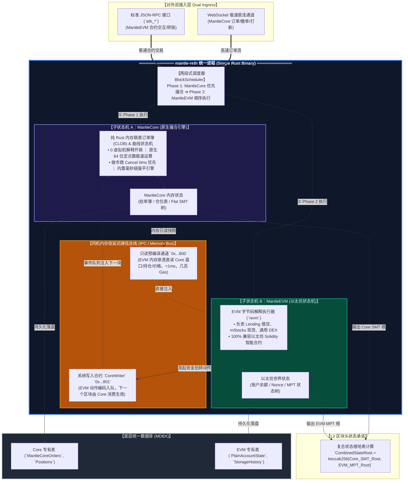
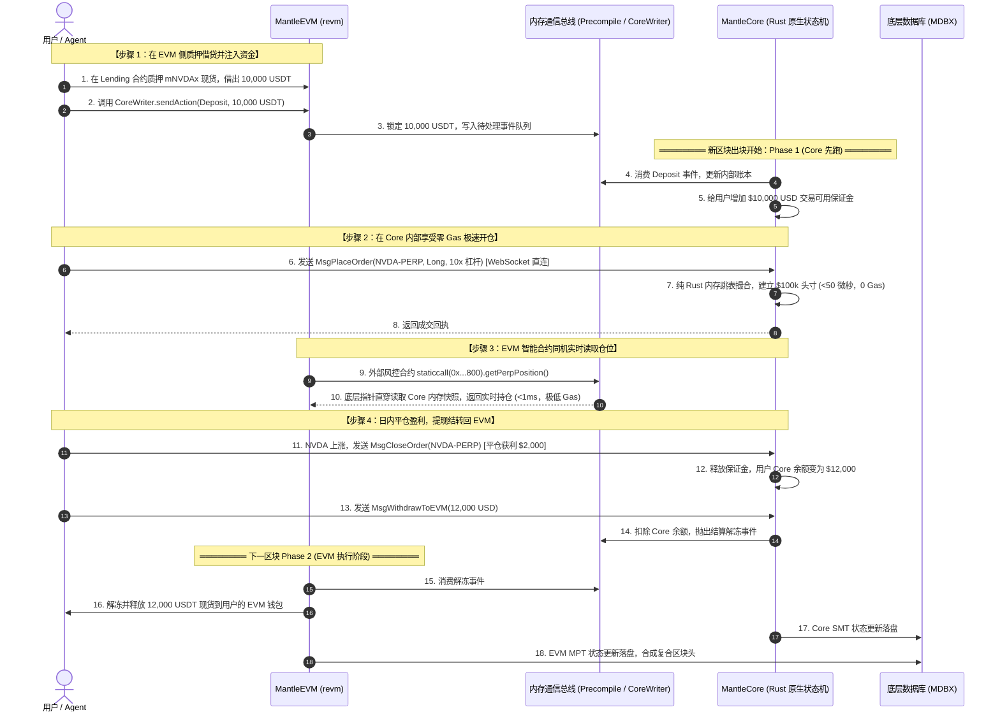

# Mantle 路线二专题技术白皮书：基于 mantle-reth 的同机双状态机架构（MantleCore + MantleEVM）深度推演

> **文档定位**：技术架构深度推演与战略白皮书（Route 2 Architectural Whitepaper）  
> **核心命题**：借鉴 Hyperliquid「HyperCore + HyperEVM」同机双引擎思想移植至 Mantle 的完整工程设计、端到端交易流、EVM 痛点破解方案与 ZK 证明现实挑战。  
> **存放路径**：`0-narrative/08-route-2-hypercore-dual-engine-deep-dive.md`  
> **制定日期**：2026-09-13

---

## 0. 核心概念与本质定性

在传统以太坊架构中，一个执行节点（如 Geth、Reth）内部只维护一套以太坊状态机，且所有智能合约计算完全依赖虚拟机（EVM / `revm`）解释执行。

**路线二（Hyperliquid 模式）的工程本质是：**
> **在一个统一的操作系统进程（`mantle-reth` 客户端）内部，同时托管两套并行的子状态机：**
> 1. **专有交易状态机（`MantleCore`）**：纯 Rust 硬编码的裸机撮合引擎（**零解释器开销、直接运行原生 CPU 机器码**），负责订单簿撮合、Bonding Curve 算价、做市商撤单与仓位强平；
> 2. **通用以太坊状态机（`MantleEVM`）**：标准的以太坊状态机（**内嵌 `revm` 字节码解释器**），负责 Lending 借贷、通用 ERC-20 资产与生态可编程合约。

两套状态机同处一片物理内存，通过**内存直读预编译（Precompiles）**与**系统写入合约（CoreWriter）**通信，物理上彻底消灭了跨链桥。

---

## 1. 系统架构拓扑图 (System Architecture)

整个系统由统一的 `mantle-reth` 二进制程序托管，对外暴露双接入通道，对内统一提交复合状态根：



---

## 2. 复合状态机内部运转与同机低延迟通信协议

### 2.1 两段式区块执行流水线 (Two-Phase Execution)
为确保在单个区块内两套状态机的强一致性，`mantle-reth` 的出块流程严格拆解为两个时钟阶段：
1. **Phase 1（MantleCore 优先撮合阶段）**：
   - Sequencer 优先执行全部原生交易：外部行情预言机更新 ➔ 做市商撤单（Cancel 0 延迟清空）➔ 用户吃单撮合 ➔ 仓位强平检查 ➔ Meme 曲线状态买卖；
   - 产生最新的内存状态快照，计算出阶段性的 **`CoreStateRoot`**。
2. **Phase 2（MantleEVM 合约执行阶段）**：
   - 紧接着执行普通以太坊智能合约交易；
   - 合约如需查询价格或保证金，通过预编译直接透传读取 Phase 1 留下的 Core 快照；
   - 合约如需划转资产，调用 `CoreWriter` 写入动作队列；
   - 产生 **`EVMStateRoot`**。
3. **Phase 3（区块头合成）**：
   - `CombinedBlockStateRoot = keccak256(CoreStateRoot, EVMStateRoot)`，生成唯一区块对外广播。

### 2.2 内存只读通道：`IMantleCoreReader` (`0x...800`)
```solidity
// 地址: 0x0000000000000000000000000000000000000800
interface IMantleCoreReader {
    // 读取用户在 Core 内部的永续合约持仓（耗时 <1ms，几百 Gas）
    function getPerpPosition(address trader, uint32 marketId) 
        external view returns (
            int256 size, 
            uint256 entryPrice, 
            int256 unrealizedPnL, 
            uint256 marginAllocated
        );

    // 读取 Core 内部指定标的实时 Mark Price
    function getMarkPrice(uint32 marketId) external view returns (uint256 markPrice);

    // 读取 Launchpad 曲线当前储备金与毕业状态
    function getBondingCurveState(uint256 tokenId) 
        external view returns (uint256 currentReserve, uint256 tokensSold, bool isGraduated);
}
```

### 2.3 内存写入通道：`ICoreWriter` (`0x...801`)
```solidity
// 地址: 0x0000000000000000000000000000000000000801
interface ICoreWriter {
    event ActionSubmitted(address indexed sender, uint8 actionType, bytes payload);

    // 统一动作提交入口（下一区块由 MantleCore 消费生效）
    function sendAction(bytes calldata actionData) external payable;
}
```

---

## 3. 端到端实战交易全流程 (End-to-End Flow)

以下通过一个真实业务闭环展现两套状态机的无缝联动：  
**“用户在 EVM 质押 mStocks 借出 USDT，资金划转入 Core 极速开多 NVDA 股票合约，日内获利平仓并结算回 EVM。”**



---

## 4. 核心产品（Launchpad 与 Perps）的原生执行方案与痛点破解

| 核心痛点 | 传统以太坊 EVM (Solidity) 局限 | MantleCore 专有状态机原生解法 | 性能与机制代差 |
|---|---|---|---|
| **算法计算开销** | 解释器运行，大数加减乘除消耗 **~50,000 Gas** | CPU 寄存器 64 位定点数原生运算，耗时 **<2 微秒** | **计算提速 1,000 倍**，零 Gas 计费摩擦 |
| **存储 I/O 延迟** | SSTORE/SLOAD 写入磁盘 MPT 树，阻塞主线程 | 直接更新内存 Flat KV 结构体指针，耗时 **<50ns** | **彻底消灭磁盘 I/O 瓶颈** |
| **Meme 状态爆炸** | 死币插槽无法删除，数十万垃圾数据永久膨胀 | **内置 GC 垃圾回收器**：48h 未达标物理直接 `DROP` | **全网唯一实现死币状态物理归零** |
| **抢跑与三明治攻击** | 公共 Mempool 拼 Gas 竞价，散户被夹 | **WebSocket 纳秒物理时间戳排单，无公开抢跑池** | **数学级彻底根除三明治夹子 (Anti-MEV)** |
| **高频订单簿撮合** | 链上 CLOB 单笔消耗 **240万–420万 Gas**，物理不可行 | 纯内存双向跳表撮合，单机支持 **100,000+ 变动/秒** | **彻底抹平与 CEX 的性能鸿沟** |
| **做市商被动被狙** | 行情闪崩时，做市商撤单与 Taker 竞争同一车道 | **做市商 Cancel 享有绝对 0ms 优先排单** | **彻底消除做市商陈旧报价被套利的风险** |
| **股票周末休市断层** | 周末现货休市无流动性，易发生脱锚事故 | **动态 Skew 资金费率模型**，24/7 连续博弈周一共识 | **将周末休市事故转化为特色交易产品** |

---

## 5. 密码学证明与 Rollup 终局性分析（SP1 zkVM 的真实挑战）

路线二在单机工程上极为惊艳，但作为以太坊 ZK-Rollup，它面临着**不可忽视的密码学工程深坑**：

### 5.1 SP1 RISC-V zkVM 复合证明流水线
Mantle 作为一个 Rollup，必须把 `mantle-reth` 的全部执行过程编译进 **SP1 的 RISC-V zkVM**，生成 ZK 有效性证明提交给以太坊 L1 验证：

$$\text{ZK Proof}: (\text{OldCombinedRoot}, \text{Txs}) \implies \text{NewCombinedRoot}$$

在 SP1 zkVM Guest 内部，证明程序必须同时跑通三个模块：
1. **Core 状态转换证明**：验证纯 Rust 订单簿撮合与 Bonding Curve 算法正确性，证明平坦 SMT 树根更新无误；
2. **EVM 状态转换证明**：验证 `revm` 字节码执行与 MPT 树根更新无误；
3. **跨引擎一致性约束（Cross-Engine Invariants）**：
   * *约束 1*：证明 Precompile 读出的数据确实等于 Core 内存快照；
   * *约束 2*：证明 `CoreWriter` 提交的动作在下一区块被 Core 无篡改执行。

### 5.2 核心技术代价：
* **证明周期（Cycles）爆炸**：高频撮合会产生大量的状态跳转，导致 SP1 证明每个区块所需的 CPU/GPU 算力**激增 5–10 倍**；
* **健全性安全风险（Soundness Risk）**：标准 EVM 的 ZK 约束（如 SP1 kona）已有行业海量测试验证；而这套自研的双状态机及其内存一致性约束**全网没有先例可循**，极易存在约束遗漏，导致黑客伪造状态的毁灭性漏洞。

---

## 6. 全景优劣势深度剖析与评估矩阵

| 评估维度 | 核心表现 | 详细定性评价 |
|---|---|---|
| **性能上限** | **★★★★★ 极致** | 内存级裸机计算（微秒级），彻底消灭 EVM 字节码开销，单机轻松突破 100,000 TPS。 |
| **资金可组合性** | **★★★★★ 完美** | 资产在同一个节点进程的内存中切换记账，用户在 L2 的现货与合约无感切换，零资金碎片化。 |
| **跨链桥安全性** | **★★★★★ 零风险** | 物理上根本没有跨链桥，不存在多签被黑、中继器伪造或跨层提现延迟的风险。 |
| **抗夹与状态剪枝** | **★★★★★ 完美** | 原生 FIFO 彻底杜绝三明治攻击；内置 GC 垃圾回收器彻底解决死币对状态树的污染。 |
| **密码学证明成本** | **★ 极差（致命瓶颈）**| 必须为自研非标引擎编写 SP1 ZK 约束电路，证明 Cycles 激增，极易遭遇 Soundness 漏洞。 |
| **以太坊对齐维护** | **★ 极差（补丁地狱）**| 每次以太坊硬分叉（Pectra/Osaka 等），都必须手动重新适配双状态机胶水层，维护极其沉重。 |
| **主网爆破隔离性** | **★ 极差（单点故障）**| 撮合引擎一旦发生内存溢出或崩溃，Mantle L2 整条主网连带 25 亿国库直接瘫痪停机。 |
| **工程周期与预算** | **约 9–12 个月 ｜ >$150 万**| 属于重型操作系统与密码学底层复合工程，开发周期极长，人才要求极高。 |

---

## 7. 战略定论

* **Hyperliquid 模式的精髓**：在于用纯 Rust 状态机替代虚拟机，用裸机机器码实现极速高频撮合；
* **为什么它适合 Hyperliquid，却难为 Mantle 所用？**
  * Hyperliquid 是一条**主权 PoS L1**，它靠验证者全员重放投票对答案，**不需要向任何人证明自己**；
  * Mantle 是一条**以太坊 ZK-Rollup**，任何动作最终都必须被编译进 SP1 zkVM 生成证明给以太坊看。强推路线二，会把原本属于应用层的撮合问题，演变成**底层密码学电路线的巨大危机**，且让 25 亿国库资产承担了单点崩溃风险。
* **终极启示**：
  * 这也是为什么我们在权衡后，会发现**路线三（保持 L2 资产总行纯粹，把这套专有状态机放在独立的 L3 专属 Rollup 链上运行）**在工程解耦、降低维护成本以及隔离主网风险上更加卓越的根本原因！
