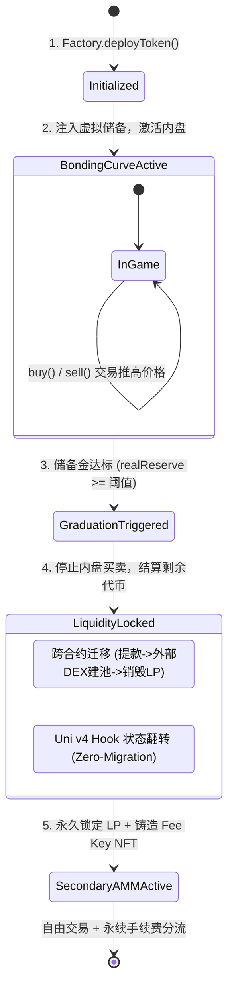

# 第二部分：Meme Launchpad 底层原理与架构实现全解（面向 Devs & CTO）

> **归属工程**：Mantle V3 资本市场体系 · 支柱 1 · 发行层工程交付  
> **文档位置**：`2-meme-launchpad/outputs/02-meme-launchpad-fundamentals.md`  
> **目标受众**：区块链开发人员、智能合约架构师与 CTO  
> **核心使命**：从 0 到 1 讲透 Meme Launchpad 的运行机制与底层工程实现。以由浅入深的结构，层层剖析数学模型、状态机流转、权限管理与核心代码模式，帮助技术团队掌握完整的 Launchpad 研发要义与安全避坑指南。

---

> ⚡ **【全篇核心 TL;DR】**：  
> 1. **本质认知**：Meme Launchpad 不是众筹平台，而是一个**“确定性定价的自驱动做市有限状态机（FSM）”**。它通过**虚拟储备（Virtual Reserves）**消灭了传统 DEX 发币的初始资金门槛，通过**代码级锁定**消灭了撤池 Rug 信任危机。
> 2. **核心流程**：包含 5 个原子阶段：`创建与元数据绑定` ➔ `虚拟曲线交易期（内盘）` ➔ `毕业阈值判定` ➔ `流动性沉淀与相变/迁移（外盘）` ➔ `二次自由做市与费用分流`。
> 3. **核心数学**：基于带虚拟储备的恒定乘积公式 $(x + v_x)(y + v_y) = k$。虚拟储备解决了初始价格 $P_0 = 0$ 被免费薅干与价格渐近无穷导致代币永远售不罄的两大极值难题。
> 4. **代际技术鸿沟**：传统实现（pump.fun/four.meme）依赖**跨合约外部资金迁移**，存在严重的 MEV 夹子抢跑与重入安全隐患；新一代实现基于 **Uniswap v4 Hooks**，通过**单池内部状态翻转（State Flip）**实现零迁移无缝相变，并配合 **Fee Key NFT** 赋予创作者永续合法现金流。
> 5. **安全与精度底线**：严守 Checks-Effects-Interactions（CEI）防重入，除法与精度计算必须**永远偏向有利于池子储备的方向取整（Rounding Favoring Pool）**，并在发币时原子化丢弃 Mint 与 Freeze 权限。

---

## 1. High-Level 宏观视角：什么是 Meme Launchpad？它颠覆了什么？

> ⚡ **TL;DR**：传统 DEX 发币需要“项目方自掏真金白银垫资做初始 LP”且存在极高“撤池跑路”道德风险；Meme Launchpad 将“出资与做市”责任完全转嫁给市场算法，用代码级状态机取代人工信任，把发币成本从数千美元压至几美分，并创造了可视化的博弈进度条。

### 1.1 传统 DEX 发币的“三座大山”
在 Uniswap / PancakeSwap 等传统 AMM 上发布新代币，对于普通开发者或社区面临三大物理障碍：
1. **高昂的初始资本垫资（Capital Requirements）**：
   * 传统 AMM 是双边注资机制。如果你想让代币具有流动性，必须自掏腰包存入数千至数万美元等值的配对资产（ETH / SOL / USDT）。这使发币成为少数资本方的特权。
2. **不可调和的撤池 Rug 信任危机（Rug Pull Dilemma）**：
   * 散户买入代币后，最大的恐慌是“项目方会不会半夜撤走底池的 ETH/SOL 跑路”。即便项目方承诺锁仓，第三方时间锁合约的权限后门、私钥失窃依然频发。
3. **首笔交易操纵（First-Block Manipulation）**：
   * 在传统池子上线的第一秒，专业 MEV 机器人会通过直接发包，抢在所有人之前以近乎为零的底价扫光筹码，普通散户进场即沦为接盘侠。

### 1.2 Launchpad 的颠覆性重构：状态机与虚拟做市
Meme Launchpad 并不是一个单纯的前端发币工具，它的核心是一套**自闭环的链上清算状态机**：

```
┌────────────────────────────────────────────────────────────────────────┐
│ 传统 DEX 模式 vs Meme Launchpad 模式对比                                │
├────────────────────────────────────────────────────────────────────────┤
│ 【传统 DEX 模式】                                                      │
│ 项目方掏 $10K ETH + 100% 代币 ──► 注入 DEX ──► 散户交易 ──► 项目方可随时撤池│
│                                                                        │
│ 【Meme Launchpad 模式】                                                │
│ 发币者掏 $2 手续费 (0 垫资)   ──► 算法生成虚拟储备 ──► 市场买卖推动曲线 │
│                                                        │               │
│                                                        ▼ 达到阈值      │
│                                           系统状态机自动锁池/相变      │
│                                           (无任何人能卷款撤池)         │
└────────────────────────────────────────────────────────────────────────┘
```

* **出资责任转嫁给市场**：通过算法在合约内部预设“虚拟储备金”，合约自身充当流动性对手盘。
* **把信任问题降维为数学问题**：底池在打满之前完全由合约锁定，没有提取接口；打满后自动触发确定性代码注入永久流动性，撤池在物理层面不可能发生。
* **进度条的博弈心理学（Schelling Point）**：打新门槛（如 85 SOL 或 $12K 美元）是一个公开可见的“谢林点”。散户清晰知晓还差多少资金毕业，群体投机买入行为同时变成了推动代币“上市”的集体协作。

---

## 2. 端到端生命周期全景流程（Lifecycle & Workflow）

> ⚡ **TL;DR**：代币从创建到成熟经历 5 个严格定义的相态：`初始化` ➔ `内盘曲线交易` ➔ `毕业触发判定` ➔ `底池锁定与相变/迁移` ➔ `外盘二次交易与费用分流`。各状态之间由不可逆的触发条件严格驱动。

### 2.1 状态机流转全景图



### 2.2 五大关键步骤拆解

#### 步骤一：代币创建与元数据锚定（Token Mint & Metadata Binding）
* **动作**：用户调用 Factory 合约的 `createToken(name, symbol, uri)` 方法，并支付极低的手续费（如 0.005 BNB 或几美分 Gas）。
* **链上动作**：
  1. Factory 合约克隆或部署一个标准 ERC-20 / SPL-Token 合约，铸造固定总量（通常为 10 亿枚）；
  2. 将 75%~80% 的代币打入当前对应的 Bonding Curve 合约，剩余 20%~25% 暂时冻结锁定（准备留给毕业后的 AMM 底池）；
  3. **关键操作**：工厂合约原子化地销毁代币的 `mintAuthority`（丢弃铸币权，保证绝不增发）与 `freezeAuthority`（丢弃冻结权，保证绝非貔貅盘）。

#### 步骤二：内盘联合曲线交易期（Bonding Curve Active Trading Phase）
* **动作**：代币正式开盘，散户与机器人通过调用 Bonding Curve 合约的 `buy()` 与 `sell()` 进行买卖。
* **结算规则**：
  * 买入时，用户支付原生币（如 SOL、ETH、USDT），曲线根据当前状态计算出代币数量返给用户，原生币沉淀在曲线合约中；
  * 卖出时，用户返还代币给曲线销毁/存回，合约按当前曲线价格退回原生币；
  * 每一笔交易向用户扣取固定手续费（通常为 1%），实时累积进协议与创作者分账地址。

#### 步骤三：阈值达成与毕业事件判定（Graduation Trigger Event）
* **触发条件**：当多笔买单将曲线中的代币全部买完（即 `realTokenReserves == 0`），或者沉淀的原生币达到预设阈值（如 $12,000 美元等值）时。
* **状态机保护**：
  * 合约内部状态立即翻转为 `Graduated = true`；
  * 此时立即阻断后续的所有 `buy()` 和 `sell()` 调用，防止在结算过程中发生资金混淆；
  * 抛出 `GraduationTriggered` 全局事件，通知链下索引器与交易终端。

#### 步骤四：底池流动性沉淀与相变/迁移（Liquidity Provision & Lock）
* **核心任务**：把曲线阶段募集到的真实储备金（如 12,000 USDT）与先前预留的 2 亿枚代币，结合成一个成熟的流动性底池。
* **两条实现路径**：
  * **传统路径（旧式迁移）**：曲线合约调用外部 DEX（如 Uniswap/Raydium）的 Router 接口建立流动性 Pair，然后将获得的 LP Token 打入 `0x...dead` 黑洞销毁；
  * **现代路径（v4 Hook 相变）**：无需任何跨合约资产划转，Hook 合约在内部直接修改路由指针，原先的虚拟曲线池无缝“就地相变”为 Concentrated Liquidity（集中流动性）自由池。

#### 步骤五：外盘自由交易与手续费路由（Secondary AMM & Fee Routing）
* 代币进入全链无许可自由交易阶段，被 DEX 聚合器（1inch、UniswapX）和行情软件（DexScreener）全面收录；
* 创作者依靠此前生成的 **Fee Key NFT**，享有该池永久交易手续费分成，开始捕获长期运营价值。

---

## 3. 核心技术组件与数学机制深度剖析

> ⚡ **TL;DR**：本节拆解支撑 Launchpad 运转的 6 大核心模块：虚拟储备消除极值奇点的数学推导、无权限 ERC-20 设计、拉式（Pull）费用分账、Uniswap v4 零迁移 Hook 实现、无出口 Locker 结构、以及开盘衰减税防狙击。

---

### 3.1 组件一：虚拟储备恒定乘积曲线（Bonding Curve Math）

#### 3.1.1 为什么必须引入“虚拟储备（Virtual Reserves）”？
若直接使用纯粹的真实储备恒定乘积公式 $x \cdot y = k$：
* **下渐近线灾难（$P_0 = 0$）**：如果池子初始只有代币、没有真实资金（$x=0$），初始代币价格为 0。第一个买家哪怕只付 0.0001 美元，就能根据数学公式抽干池子中几乎全部的代币。
* **上渐近线灾难（价格无穷大，永远无法毕业）**：当买家把代币买到接近 0 时，根据 $y \to 0 \implies x \to \infty$，代币价格趋于无穷大，导致最后剩余的代币在现实中没有任何人买得起，曲线永远无法彻底售罄并触发毕业。

**虚拟储备的物理本质**：通过在数学公式中引入两个“假想的常数”（虚拟资金 $v_x$ 与虚拟代币 $v_y$），**人为平移了双曲线的有效定义域**，定义了可用、可计算的初始启动价，并确保当代币可售配额归零时，价格收敛在一个有限的可达数值。

#### 3.1.2 精确数学模型与公式推导

```
                      虚拟资金储备 (Virtual Quote)
                               ▲
                               │               • 毕业点 (Graduation Point)
                               │              /
      (v_x + real_x) ─────────┼─────────────• 真实储备累积达到目标 (e.g. 85 SOL)
                               │            /
                               │           /   实际有效交易区间 (Valid Curve Range)
                         v_x ──┼──────────• 初始启动点 (P_0 = v_x / v_y)
                               │         /
                               │        /
                               └───────•───────────────────────────────► 虚拟代币储备
                                       │                                 (Virtual Token)
                                       └── (v_y - real_y)
```

定义符号常数与初始储备（以经典 pump.fun 链上真实反编译参数为例）：

| 储备类别 | 资金侧（Quote: SOL） | 代币侧（Token: Meme） | 核心说明 |
|---|---|---|---|
| **虚拟储备（Virtual）** | $v_x = \mathbf{30 \text{ SOL}}$（$3 \times 10^{10}$ lamports） | $v_y = \mathbf{1,073,000,000 \text{ 枚}}$ | 仅作为公式计算常数，**链上无物理资金** |
| **真实开盘储备（Real at Launch）** | $real_x = \mathbf{0 \text{ SOL}}$（**项目方垫资为 0**） | $real_y = \mathbf{793,100,000 \text{ 枚}}$ | 真实注入曲线供市场公开买卖（占总量 79.31%） |
| **留存储备（Reserved for LP）** | $0 \text{ SOL}$ | $S_{lp} = \mathbf{206,900,000 \text{ 枚}}$ | 暂时冻结锁定，留给毕业后注入 DEX 底池（占 20.69%） |
| **发币团队实际准备资金** | **0 SOL（完全零垫资）** | 100% 凭空铸造的代币 | 仅需支付约 **0.02 SOL（~$2）** 的链上账户租金与 Gas 费 |

恒定乘积不变量：
$$k = v_x \cdot v_y = 30 \times 1.073 \times 10^9 = 3.219 \times 10^{10} \text{ (SOL}\cdot\text{Token)}$$

**1. 初始价格与开盘名义市值（Initial Price & Starting FDV）**：
开盘第 0 秒，代币的瞬时边际价格由虚拟储备的比例直接决定：
$$P_0 = \frac{v_x}{v_y} = \frac{30 \text{ SOL}}{1.073 \times 10^9 \text{ Token}} \approx \mathbf{2.7959 \times 10^{-8} \text{ SOL/token}}$$
若按照 **$\text{SOL} = \$100$** 换算：
* 初始单价约为：$2.7959 \times 10^{-6} \text{ 美元}$；
* 起始名义完全稀释估值（Starting FDV）：
  $$\text{FDV}_0 = 10^9 \times P_0 \times \$100 \approx \mathbf{\$2,796 \text{ 美元}}$$
* **关键认知**：虽然开盘名义市值有 **$2,796 美元**，但池子里**一分钱真实资金都没有（Real SOL = 0）**！这是用 30 虚拟 SOL 锚定出来的纯数学名义价格，彻底消灭了项目方的初始出资门槛。

**2. 毕业募资额与毕业价格（Graduation Math）**：
当所有可售的真实代币 $S_{real} = 793,100,000$ 枚被全部买完时，池中剩余的虚拟代币数量为：
$$v_y' = v_y - S_{real} = 1,073,000,000 - 793,100,000 = 279,900,000 \text{ 枚}$$
根据恒定乘积不变量 $k$ 不变，此时池中的总虚拟资金储备为：
$$v_x' = \frac{k}{v_y'} = \frac{3.219 \times 10^{10}}{2.799 \times 10^8} \approx 115.005 \text{ SOL}$$
由此可精确解出**毕业时从市场上实际募得的真实资金净额**（$\Delta x$）：
$$\Delta x = v_x' - v_x = 115.005 - 30.000 = \mathbf{85.005 \text{ SOL}} \quad (\text{按 SOL}=\$100 \text{ 计约 } \mathbf{\$8,500.5 \text{ 美元}})$$
此时代币在内盘毕业时刻的瞬时边缘成交价格为：
$$P_{grad} = \frac{v_x'}{v_y'} = \frac{115.005}{2.799 \times 10^8} \approx \mathbf{4.1088 \times 10^{-7} \text{ SOL/token}} \quad (\approx \$4.1088 \times 10^{-5} \text{ 美元})$$
毕业时的完全稀释估值（Graduation FDV）：
$$\text{FDV}_{grad} = 10^9 \times P_{grad} \times \$100 \approx \mathbf{\$41,088 \text{ 美元}}$$

**内盘全程理论涨幅空间**：
$$\text{Multiple} = \frac{P_{grad}}{P_0} = \frac{4.1088 \times 10^{-7}}{2.7959 \times 10^{-8}} \approx \mathbf{14.70 \text{ 倍}}$$
#### 3.1.3 单笔 Swap 的执行输入输出公式
当用户投入 $\Delta x_{in}$ 的资金买入代币时（已扣除手续费）：
$$\Delta y_{out} = (v_y - y_{sold}) - \frac{k}{(v_x + x_{collected}) + \Delta x_{in}}$$
反之，当用户出让 $\Delta y_{in}$ 的代币卖出套现时：
$$\Delta x_{out} = (v_x + x_{collected}) - \frac{k}{(v_y - y_{sold}) + \Delta y_{in}}$$

#### 3.1.4 智能合约定点数（Fixed-Point Math）防溢出实践
在 Solidity 中实现此公式，必须极其小心截断与溢出：
```solidity
// 伪代码参考：计算买入获得的 Token 数量（遵循向有利于池子的方向截断）
function calculateTokensOut(uint256 quoteInAfterFee) public view returns (uint256 tokensOut) {
    uint256 currentVirtualQuote = virtualQuoteReserves + realQuoteReserves;
    uint256 currentVirtualToken = virtualTokenReserves - realTokenSold;
    
    // newVirtualQuote = currentVirtualQuote + quoteInAfterFee
    uint256 newVirtualQuote = currentVirtualQuote + quoteInAfterFee;
    
    // newVirtualToken = k / newVirtualQuote (向下取整，使得用户拿到的代币偏少，池子留存偏多)
    uint256 newVirtualToken = K / newVirtualQuote;
    
    tokensOut = currentVirtualToken - newVirtualToken;
    
    // 保护边界：绝不能超卖超出曲线限额
    require(realTokenSold + tokensOut <= maxTokensForSale, "Exceeds curve limit");
}
```

---

### 3.2 组件二：代币标准与权限裁撤（Token Lifecycle & Revocation）

> ⚡ **TL;DR**：Meme 代币必须是标准 ERC-20。发币工厂部署完毕后，必须原子化放弃铸币权（Mint Authority）与冻结权（Freeze Authority），这是规避“貔貅盘”与代码级信任的第一步。

* **代币合约选型**：推荐采用标准轻量级实现（如 OpenZeppelin `ERC20Burnable` 或 Solmate `ERC20`），杜绝在代币逻辑中植入黑名单、可暂停或自定义税费逻辑。所有交易费与风控逻辑应全部由 DEX / 曲线外挂处理。
* **权限丢弃模式（Authority Stripping）**：
  ```solidity
  function createMemeToken(string memory name, string memory symbol) external returns (address tokenAddress) {
      // 1. 部署代币
      MemeToken token = new MemeToken(name, symbol, TOTAL_SUPPLY);
      
      // 2. 将代币转入曲线合约托管
      token.transfer(address(bondingCurve), CURVE_SUPPLY);
      token.transfer(address(this), LP_RESERVE_SUPPLY); // 锁在工厂备用
      
      // 3. 彻底注销权限（如果实现带 Ownable / AccessControl）
      // 确保合约没有任何再铸造 (Mint) 接口，或调用 renounceOwnership()
      
      emit TokenCreated(address(token), msg.sender);
  }
  ```

---

### 3.3 组件三：费用结构与拉式结算路由（Fee Accounting & Pull Routing）

> ⚡ **TL;DR**：内盘交易统一扣减 1% 手续费。切忌在交易核心路径中通过外部 `transfer()` 实时分发资金，必须采用“拉式取款（Pull over Push）”记账模式，防范重入攻击并压降 Gas。

#### 3.3.1 费用分流比例
在典型设计中，每笔内盘 Swap 收取的 1% 交易手续费进行分流：
* **45%（总交易量的 0.45%）**：归代币创建者（Creator）；
* **45%（总交易量的 0.45%）**：归 Launchpad 协议金库（Treasury）；
* **10%（总交易量的 0.10%）**：归推荐人或用于二级市场代币回购。

#### 3.3.2 为什么必须是“拉式（Pull）记账”？
* **Push 模式的致命隐患**：如果每次用户 Swap 时，合约都调用 `creator.call{value: fee}("")` 强行把手续费打给创作者：
  1. 如果创作者是一个恶意合约，其 `fallback()` 函数可以故意 `revert`，从而导致全平台的代币无法被买入或卖出；
  2. 极易给黑客构造重入攻击（Reentrancy）提供外部调用上下文。
* **Pull 模式的安全实现**：
  ```solidity
  mapping(address => uint256) public pendingFees;

  // 在 buy() / sell() 内部只做状态累加
  function _distributeFee(uint256 feeAmount, address creator) internal {
      uint256 creatorPart = (feeAmount * 45) / 100;
      uint256 protocolPart = feeAmount - creatorPart;
      
      pendingFees[creator] += creatorPart;
      pendingFees[treasury] += protocolPart;
  }

  // 由创作者或协议方单独调用提现
  function claimFees() external nonReentrant {
      uint256 amount = pendingFees[msg.sender];
      require(amount > 0, "No fees");
      pendingFees[msg.sender] = 0;
      
      (bool success, ) = msg.sender.call{value: amount}("");
      require(success, "Transfer failed");
  }
  ```

---

### 3.4 组件四：毕业流向机制对比 —— 跨合约迁移 vs Uniswap v4 零迁移 Hook

> ⚡ **TL;DR**：跨合约迁移是 four.meme 被盗 $18.3 万与 pump.fun 屡遭 MEV 抢跑的罪魁祸首；新一代 Launchpad 必须采用 Uniswap v4 Hooks，通过单池内部状态相变（State Flip）实现物理层面的零资金转移。

```
┌─────────────────────────────────────────────────────────────────────────┐
│ 跨合约迁移方案 (Legacy) vs Uni v4 单池状态相变方案 (Modern)              │
├─────────────────────────────────────────────────────────────────────────┤
│ 【方案 A：传统外部迁移 (Legacy)】                                       │
│ 1. 曲线合约打满 ──► 2. 提取资金并批准 ──► 3. 跨合约调用外部 DEX Router    │
│                                           │ (黑客漏洞重灾区)            │
│                                           ▼                             │
│ 4. 外部 DEX 建池 ──► 5. 收到 LP 代币 ──► 6. 销毁 LP                     │
│    (MEV 机器人在同一区块抢跑吃底价)                                     │
│                                                                         │
│ 【方案 B：Uniswap v4 Hooks 零迁移相变 (Modern)】                        │
│ 1. 创建即在 Uni v4 池内 ──► 2. Hook 接管 beforeSwap (强制曲线定价)       │
│                                           │                             │
│                                           ▼ 达到阈值                    │
│ 3. Hook 内部翻转 isGraduated = true ──► 4. 自动解禁集中流动性做市       │
│    (零外部调用、零资金转移、零夹子窗口、K线全程连续)                     │
└─────────────────────────────────────────────────────────────────────────┘
```

#### 3.4.1 方案 A：传统跨合约迁移及其漏洞根源
* **流程**：曲线打满 ➔ 曲线合约调用 `router.addLiquidity()` ➔ 产生新的 Pair ➔ 将 LP 发送至黑洞。
* **致命弱点**：
  1. **MEV 夹子攻击面**：从曲线结束到 DEX 初始化的微秒级间隙，套利机器人可以精准夹击该交易，抢占第一买单；
  2. **逻辑校验漏洞**：four.meme 遭遇攻击正是因为黑客利用伪造代币或重复触发外部迁移，绕过了仓位检查。

#### 3.4.2 方案 B：Uniswap v4 Hooks 的单池零迁移相变（最佳工程实践）
* **原理**：代币开盘第一秒，就直接以 Uniswap v4 Pool 的形态部署。
* **Hook 核心逻辑**：
  ```solidity
  contract LaunchpadHook is BaseHook {
      struct PoolState {
          bool graduated;
          uint256 virtualQuote;
          uint256 virtualToken;
          uint256 realCollected;
      }
      mapping(PoolId => PoolState) public poolStates;

      function beforeSwap(
          address,
          PoolKey calldata key,
          IPoolManager.SwapParams calldata params,
          bytes calldata
      ) external override returns (bytes4, BeforeSwapDelta, uint24) {
          PoolState storage state = poolStates[key.toId()];
          
          if (!state.graduated) {
              // 阶段 1：曲线阶段，Hook 完全接管扣划与定价计算
              // 扣除 Delta 并按虚拟储备算法结算...
              if (state.realCollected >= GRADUATION_THRESHOLD) {
                  // 达成毕业阈值，就地翻转状态！
                  state.graduated = true;
                  emit Graduated(key.toId());
              }
              return (BaseHook.beforeSwap.selector, toBeforeSwapDelta(amountSpecified, tokenAmount), 0);
          }
          
          // 阶段 2：已毕业，放行进入 Uniswap v4 常规集中流动性撮合
          return (BaseHook.beforeSwap.selector, BeforeSwapDeltaLibrary.ZERO_DELTA, 0);
      }
  }
  ```
* **工程优势**：**资金从未离开过 Uniswap PoolManager**。没有迁移交易，不存在任何夹子时间差，代币地址和池地址终身不变。

---

### 3.5 组件五：流动性防撤池锁定（Immutable Locker vs LP Burn）

> ⚡ **TL;DR**：LP 打入黑洞销毁会导致手续费永久浪费；无出口合约（No-Withdraw Locker）既能在代码级杜绝撤池 Rug，又能将手续费提取权铸造成 Fee Key NFT，让项目方享有长期现金流。

| 模式 | 实现方式 | 信任级别 | 收益权归属 | 适用场景 |
|---|---|---|---|---|
| **LP Burn（烧池）** | 将 LP ERC-20 代币转给 `address(0)` 或 `0xdead` | 最高（数学不可逆） | **手续费被彻底孤儿化**，谁也领不走 | pump.fun 早期 / 简单纯空气币 |
| **无出口锁仓 (No-Withdraw Locker)** | 将 LP 存入一个**完全没有提币函数**的合约，仅保留 `collectFees()` | 与烧池等价（代码完全锁定） | **保留并可自由路由**，铸造 Fee Key NFT | Clanker / Pons / 现代化 Launchpad |

* **Fee Key NFT 架构设计**：
  * 当底池流动性进入 Locker 时，Locker 合约铸造一枚专属的 ERC-721 NFT；
  * 该 NFT 的持有者是唯一有权向 Locker 请求划转累积交易手续费的实体；
  * **创作者解绑老鼠仓**：发币团队有了持续的现金流来源，这枚 NFT 本身具备极高的内在金融价值，可以在市场上转让或向借贷协议抵押。

---

### 3.6 组件六：开盘抗狙击与 MEV 治理（Anti-Sniping Mechanics）

> ⚡ **TL;DR**：开盘前 30 秒是专业抢跑 Bot 的狩猎场。单靠 Gas 竞价会伤害真实用户，必须在合约层综合运用“开盘动态衰减税”与“单钱包持仓硬顶”。

#### 3.6.1 动态衰减费率（Descending Fee Hook）
* **机制**：开盘第 0 秒设定极高的手续费（如 80%~99%），并在接下来的 15~60 秒内呈抛物线或线性衰减回正常的 1%。
* **数学公式**：
  $$\text{Fee}(t) = \text{Fee}_{min} + (\text{Fee}_{max} - \text{Fee}_{min}) \times \left(1 - \frac{t}{T_{decay}}\right)^2$$
* **阻断原理**：狙击 Bot 即使在第一笔交易买入，其瞬间付出的 80%+ 手续费会使其入场成本暴增数倍，彻底消灭其短线砸盘套利的利润空间。这笔高额手续费直接反哺给底池或创作者。

#### 3.6.2 单钱包持仓硬顶（Max-Wallet Cap）
* **机制**：在曲线打新阶段，合约强行限制：
  $$\text{BalanceOf}(user) \le \text{TotalSupply} \times 2\%$$
* **效果**：任何大户或内幕团队无法在一个地址内囤积大量筹码，配合 Sybil 防范（如 Spend-Gate 或多签名限制），保证代币分发的去中心化程度。

---

## 4. Devs & CTO 避坑指南与安全 Checklist

> ⚡ **TL;DR**：开发 Launchpad 智能合约必须严防四类死穴：重入攻击导致资金被抽干、除法向上舍入导致资金库空头支票、外部调用失败导致整池被 DOS、以及迁移交易被抢跑。

### 4.1 精度与舍入方向（Rounding Rule）
* **铁律**：在处理所有池内兑换时，**进池资金向上取整（Rounding Up），出池代币/资金向下取整（Rounding Down）**。
* **反面教材**：若在计算用户出让 Token 所应退还的 ETH 时进行了向上取整，攻击者可以用粉尘数量反复调用 `sell()`，产生微小差额累积，最终将曲线储备金全部抽干（Drain）。

### 4.2 严格防范只读重入（Read-Only Reentrancy）
* 许多 Launchpad 对外暴露了 `getCurvePrice()` 或 `calculateTokensOut()` 视图函数供第三方协议或前端调用；
* 如果这些函数读取了处于 Swap 执行半途的脏状态（Dirty States），借贷或聚合器协议在与 Launchpad 交互时极易遭受价格预言机操纵攻击；
* **解法**：在所有改变状态的写函数和敏感视图函数上，全覆盖引入重入锁（ReentrancyGuard）。

### 4.3 生产环境上线前 Checklist

```markdown
- [ ] [权限控制] 代币的 Mint 权限是否在部署同一笔交易内被丢弃至 address(0)？
- [ ] [权限控制] 是否杜绝了任何黑名单、白名单、可暂停等类似貔貅盘的特权开关？
- [ ] [数学安全] 在极限值场景（首笔最小买入 1 wei、末笔刚好买满、超额买入溢出）下是否有单元测试全覆盖？
- [ ] [算法截断] 所有除法截断方向是否均对池子本身有利？
- [ ] [费用结算] 创作者费用是否采用“拉式取款（Pull）”而非强行 Push 转账？
- [ ] [相变/迁移] 如果使用 v4 Hook，状态切换是否原子化？若为旧式迁移，是否具有防重入与独占性权限校验？
- [ ] [MEV 防护] 是否配置了开盘首阶段的单钱包持仓硬顶或动态费率限制？
- [ ] [Gas 优化] 核心交易循环中是否尽量避免了昂贵的动态数组遍历与重复 SLOAD？
```
