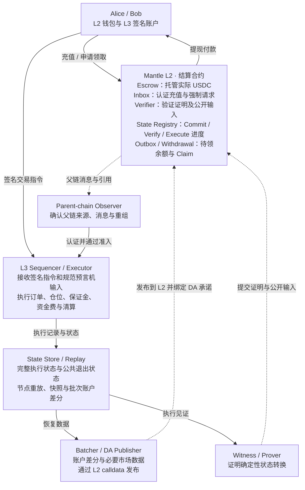
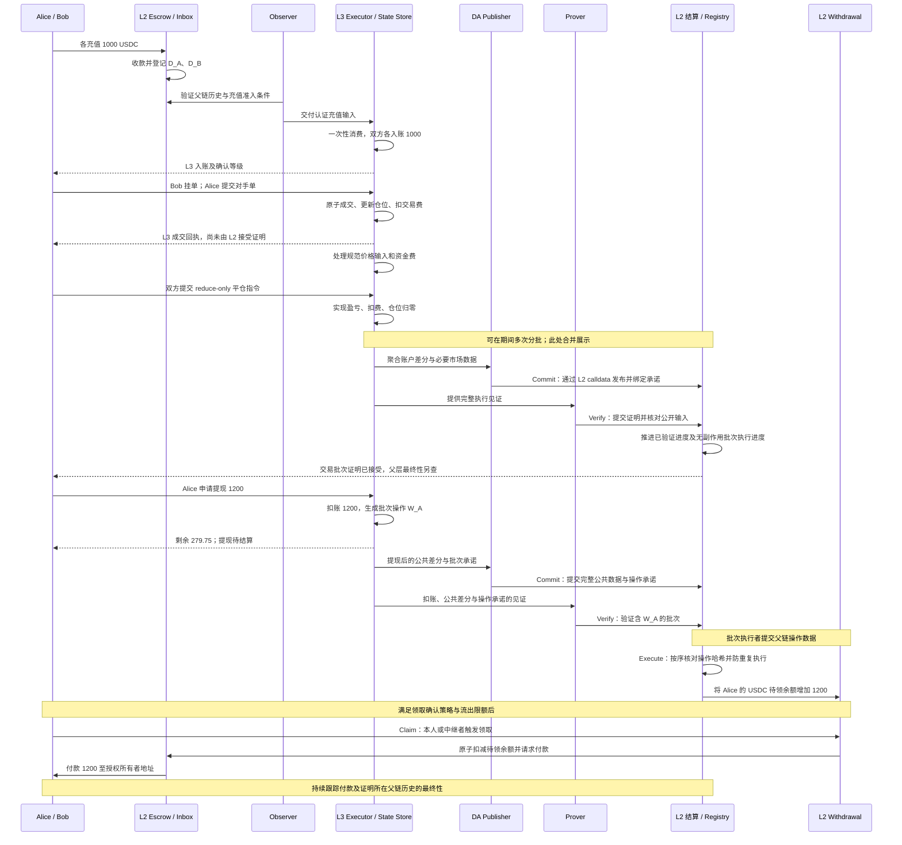

# 一笔 Perps 交易如何走完 Mantle L3：从充值、成交到证明、提现与故障退出

> 本文是[新版 Mantle App-specific L3 设计（09）](../0-narrative/09-native-l3-architecture-and-errata.md)的配套案例，按其中借鉴 Lighter 的批次结算与公共退出状态设计展开；实现参照见 [11 Lighter 参考设计](../0-narrative/11-lighter-reference-for-mantle-l3.md)。09 是用于路线比较的设计提案，尚不代表选型或部署；本文也不是一个已上线产品的操作手册。
>
> 案例采用单一稳定币保证金、有限市场、独立 Sequencer、原生订单簿状态机、公开 DA，以及在 Mantle L2 上验证有效性证明。所有价格、仓位、费率和风险阈值都是教学假设，不是生产建议。09 尚未确定的退出规则，会明确标为案例假设或待决项。

Alice 和 Bob 都在 Mantle L2 上持有 USDC。Alice 想做多 ETH 永续合约，Bob 愿意做空。两人各拿出 1,000 USDC，准备在一条以 Mantle 为结算层的 Perps L3 上交易。

交易期间，实际 USDC 存在 Mantle L2 的托管合约里。L3 负责记录谁有多少权益、谁持有什么仓位、订单是否成交、保证金是否充足。等到提交批次时，L3 把数据和证明交给 L2；L2 验证状态变化后，才允许兑付对应的提现请求。

这一分工让挂单、撤单、成交和清算可以连续在应用内部运行。它也意味着，用户看到“成交”时，需要知道这个结果只进入了 L3 历史，还是已经由 L2 接受证明，以及包含该证明的父链历史是否已经最终确定。

## 1. 先给案例划定边界

这条示例 L3 只开放少量加密资产市场，正文只追踪 ETH-USDC 永续合约。它不持有或交割 ETH 现货，盈亏全部用 USDC 结算。Alice 做多 5 ETH、Bob 做空 5 ETH，表示两人持有方向相反、数量相等的衍生品头寸。

| 项目 | 本文采用的教学假设 |
|---|---|
| 保证金 | 只接受一种明确指定的 USDC 合约；展示时假设 1 USDC = 1 美元，不讨论脱锚 |
| 充值 | Alice、Bob 各充 1,000 USDC；没有其他交易者或外部补贴资金 |
| 开仓 | Alice 买入、Bob 卖出 5 ETH，成交价 2,000 USDC/ETH，双方各有 10,000 USDC 名义敞口 |
| 初始保证金 IM | 当前参考价格下名义敞口的 5%；开仓时每人需要 500 USDC，手续费另留额度 |
| 维持保证金 MM | 当前参考价格下名义敞口的 2.5%；权益低于该线时进入清算流程 |
| 交易费 | 每次成交双方各付成交名义金额的 0.05%，记入同一手续费账户；不设 maker 返佣 |
| 资金费 | 只跨过一个资金费区间，累计指标增加 2 USDC/ETH，多头向空头支付 10 USDC；相当于入场名义金额的 0.1% |
| 正常平仓 | 双方以 2,100 USDC/ETH 全部平仓，此前没有其他成交或提现 |
| 持仓期间可提规则 | 保守地只允许提取“已记账余额与权益中较小值”扣除 IM、挂单预留及费用缓冲后的非负部分；正未实现盈亏不提前提走 |
| 确认策略 | 主线等充值达到已配置的父链准入条件后才开放交易；不指定固定秒数。提前使用暂定充值是后面的故障分支 |

上述数值用于把账算清楚。实际 IM/MM、挂单风险预留、标记价、资金费和可提余额规则需要产品风控另行签定。资金费按规范时间与累计指标计算，不能由 Executor 读取本机时钟后随意记账；金额和数量使用整数精度与确定的舍入规则，本例数字都能整除。表格只追踪托管 USDC 和对应负债，L2 交易 Gas、DA 与证明服务费用由另设的运营或用户预算支付，不混入这 2,000 USDC 的账本。

L3 的交易账户、订单和仓位是原生业务状态，不要求兼容任意 Solidity 合约或 Ethereum JSON-RPC。钱包通过签名 SDK 和应用 API 发送原生指令。这个范围来自 [09 §1.1 基础方案](../0-narrative/09-native-l3-architecture-and-errata.md#11-基础方案与可选扩展)和 [§3.2 非 EVM 的范围](../0-narrative/09-native-l3-architecture-and-errata.md#32-非-evm-的范围)。

## 2. 钱、账本和证明分别由谁负责

### 2.1 总体职责图

图中实线表示调用、数据依赖或资金流，文字标签区分其用途；虚线表示跨层观察或异步提交，不表示最终确认。组件是逻辑职责，不要求全部拆成独立进程。[09 §2](../0-narrative/09-native-l3-architecture-and-errata.md#2-分层架构与组件职责)

L2 的 Escrow 只托管这条 L3 对应的资产。Inbox 为充值和强制请求提供认证入口；State Registry 分别跟踪已提交、已验证和已执行的批次进度及业务程序版本；Verifier 检查证明；Outbox/Withdrawal 按承诺执行已验证批次的父链操作，累加用户待领余额，领取时再减余额并付款。L3 不能靠自己的证明支取另一条 L3 的托管资金，也不能覆盖 Mantle L2 的全局状态根。

L3 的 Sequencer 决定规范操作顺序，Executor 按这个顺序执行确定性规则。Observer 负责把 L2 历史转成可认证的充值输入；执行器维护完整交易状态及其公共退出状态；DA Publisher 发布聚合账户差分和必要市场数据；Prover 证明业务执行与这些公开结果一致。API 和 Indexer 可以显示更多实时信息，但其余额展示不能代替账本或证明。

完整执行状态包含订单索引、账户权限和操作记录等；公共退出状态保留资产归属、余额、仓位、资金费及估值所需信息。节点用执行日志和快照重放业务，用户用公开差分恢复退出权益。后者不自动提供继续运行原订单簿需要的全部数据。[09 §3.2](../0-narrative/09-native-l3-architecture-and-errata.md#32-非-evm-的范围)

### 2.2 读账本时用到的几个金额

| 金额 | 在哪里看 | 含义 |
|---|---|---|
| 实际托管余额 C | L2 USDC 合约与 Escrow | 托管合约当前真正持有多少 USDC |
| 已记账余额 B | L3 账户状态 | 充值加已实现盈亏、资金费，减手续费和已扣账提现；不含未实现盈亏 |
| 未实现盈亏 U | L3 仓位按规范标记价估值 | 如果按该参考价结算，当前仓位产生多少盈亏；并不表示已有 USDC 转账 |
| 账户权益 E | L3 风险计算 | `E = B + U`；跨过资金费结算点时，还要先计入应收应付资金费 |
| 保证金占用 | L3 风险账本 | 对权益可用性的限制，不是再扣一次 USDC |
| 可提现余额 | L3 风险规则的计算结果 | 扣除仓位要求、挂单预留、费用缓冲和未结负债后允许提走的部分 |
| 待兑付债权 W | 批次提现操作，以及 L2 待领余额账本 | 已从 L3 扣除、尚未实际在 L2 支付的总额；包含尚未 Execute 的操作和已经 Execute 的待领余额，二者不能重复相加 |

本文的保守可提规则可写为：

`可提 = max(0, min(B, E) − 当前 IM − 未成交订单的增量预留 − 费用缓冲)`

这只是本案例的一种产品规则，不是 09 规定的通用公式。没有仓位和挂单、费用已经结清时，可提金额就是 B。即使数值上“可提”，真正到账还要经过 L3 扣账、批次验证、父链操作执行、领取及父链确认。

## 3. 各充 1,000 USDC：两层先后发生什么

Alice 在 Mantle L2 发起充值交易，指定 USDC、1,000 的数量、目标 L3 身份和自己的 L3 账户。Escrow 收入资产，Inbox 在同一笔 L2 交易中登记充值消息 `D_A`；Bob 的充值生成 `D_B`。任一环节失败，该笔充值交易整体回滚。

消息需要绑定源链、指定的 Escrow/Inbox、目标 L3、资产地址、计量精度、接收账户、协议版本及唯一序号。父链区块标识和 Inbox 消费位置用于追踪该消息属于哪段历史。`D_A` 只是便于阅读的简称，不能仅拿一段日志文本或 Sequencer 签名当成充值凭证。

Observer 看到日志后，核对它是否来自指定合约和认可的父链历史，以及是否达到这条 L3 配置的准入条件。通过后，Executor 消费消息，把 Alice 的余额增加 1,000，并记录消费位置和父链依赖。重复投递 `D_A` 不会再增加余额；本例按 Inbox 规范顺序推进游标，缺失的前序输入需要补齐，不能偷偷跳过。

| 阶段 | 谁处理 | 真实资产 | L2 记录 | L3 记录与用户所见 | 下一步条件 |
|---|---|---|---|---|---|
| 用户提交充值 | 钱包、L2 执行 | 成功前仍在钱包 | 交易等待或失败 | “充值提交中” | L2 交易成功执行 |
| 托管成功、待导入 | Escrow、Inbox | 两人都成功后 C = 2,000 | `D_A`、`D_B` 已登记，但其区块仍有确认级别 | “L2 已收款，L3 待入账” | Observer 验证来源和父链准入条件 |
| L3 入账 | Observer、Executor | C 仍为 2,000 | 之前接受的 L3 根可能尚未更新 | Alice/Bob 各 B = 1,000，消息已消费；“L3 已入账” | 达到交易开放策略，且状态可恢复 |
| 后续证明覆盖充值 | DA Publisher、Prover、L2 合约 | C 仍为 2,000 | Registry 接受包含充值的状态承诺 | 可查对应批次与证明状态 | 包含证明调用的父链历史继续达到所选最终性 |

因此，两层短暂不同步是正常现象：L2 可以已经收到 2,000，而 L3 暂时仍显示零；L3 也可以已记入余额，而 Registry 仍停在上个批次。对账必须带上父链引用和批次位置。

跨层部分没有一个能同时回滚两层的同步合约调用。网络可以重试投递，接收侧负责只消费一次。本文主线采用保守准入；若开放暂定充值交易，需要处理第 9.1 节的重组分支。[09 §4.2](../0-narrative/09-native-l3-architecture-and-errata.md#42-l2--l3-原生充值)、[§4.5](../0-narrative/09-native-l3-architecture-and-errata.md#45-消息协议的必要字段与约束)

## 4. 从订单到仓位：交易期间 L2 的 USDC 不动

### 4.1 Bob 挂卖单，Alice 接受这个价格

Bob 签名提交“卖出 5 ETH，限价 2,000”的订单。指令绑定 L3 身份、账户、交易类型、市场、数量、价格限制、Nonce 和有效期，避免跨链重放或重复成交。

Sequencer 的“已收到”只说明请求进入服务；Executor 验签、检查权限和保证金后把订单放进簿子，才有“已挂单”。此时仍没有成交，Bob 也没有空头仓位。本例预留开仓保证金 500，加上开仓费 5，共 505 USDC 可用额度，B 仍是 1,000。

Alice 再提交买入 5 ETH、最高成交价 2,000 的限价 IOC 指令，即立即成交，剩余部分取消。本例全部与 Bob 成交；现实中也可能部分成交或完全不成交，回执必须分别给出数量和剩余状态。

这笔成交在 L3 的一次状态转换中完成：

- 检查双方订单授权、价格条件、剩余数量和风控限制；
- 减少订单剩余数量，Bob 的挂单预留转为持仓风险要求；
- Alice 记 `+5 ETH`，Bob 记 `−5 ETH`，入场价都为 2,000；
- 双方各扣 5 USDC 手续费，手续费账户增加 10；
- 检查成交后的权益仍满足要求，然后提交完整状态。

手续费后，双方 B 都是 995，开仓时 U = 0、E = 995，持仓 IM 为 500、MM 为 250。不能一边保留 Bob 的完整挂单预留，一边再重复扣掉 500 持仓保证金；预留需要按成交量释放或转换。

这些规则、状态写入和费率计算一起进入证明程序。任何检查失败，不能只更新 Alice 的仓位却不更新 Bob 的仓位。L2 没有为这一笔成交执行 USDC 转账，也没有逐笔批准保证金。[09 §3.1](../0-narrative/09-native-l3-architecture-and-errata.md#31-哪些状态必须在一起)、[§4.3](../0-narrative/09-native-l3-architecture-and-errata.md#43-l3-内交易)

### 4.2 撤单与清算调度的收益在哪里

假设 Bob 的订单尚未成交，他发出撤单。撤单可以直接进入本地队列，按明示的调度规则和成交竞争：如果撤单先被规范执行，订单的未成交部分消失，预留释放；如果成交先执行，撤单只能作用于剩余数量，不能撤销已成交部分。

L3 可以给撤单和清算留处理预算，不必为每次撤单等待一笔 L2 交易。但“收到撤单”仍不等于“撤单已执行”，撤单优先也不意味着能撤销任何已经排在前面的成交。具体优先级、饥饿保护和限流属于产品规则，必须可重放；Sequencer 仍可能隐瞒收到的订单，单靠 FIFO 不能证明接单公平。

用户不为每次操作付链上 Gas 时，执行、DA 和证明成本由业务收入或运营预算承担。本例手续费账户只是记录收入去向，不代表这 20.50 USDC 已经足够覆盖运行成本。免费操作仍要有配额和防刷规则。[09 §3.3](../0-narrative/09-native-l3-architecture-and-errata.md#33-排序收费与状态管理)

### 4.3 标记价变化，然后结算一笔资金费

一个通过规范验证的价格输入把标记价更新到 2,020。Alice 的 U 为 `5 × (2,020 − 2,000) = +100`；Bob 的 U 为 −100。两人的 B 仍是 995，但 E 分别变为 1,095 和 895。

预言机输入要校验来源、时间、有效性和异常条件。Executor 用进入规范输入流的价格计算风险，不能在执行过程中临时请求某家交易所 API，导致其他节点无法重放。

随后跨过本例唯一的资金费区间，累计资金费指标增加 2 USDC/ETH，Alice 付 `5 × 2 = 10`，Bob 收 10。已记账余额变为 985 和 1,005；在标记价仍为 2,020 时，权益为 1,085 和 905。

实现可以使用累计资金费指标，在账户交互时结清差额，而无需每次遍历所有账户。但风控、可提金额和退出必须计入已发生的应收应付，不能利用“尚未写入现金余额”重复使用这笔钱。表格为了便于阅读，把这 10 USDC 立即结入 B。资金费落在 Bob 账户，手续费落在手续费账户，两种去向不能混写。

### 4.4 双方在 2,100 平仓

Alice 提交卖出 5 ETH 的 reduce-only 平仓单，Bob 提交买入 5 ETH 的 reduce-only 平仓单，二者在 2,100 成交。reduce-only 用于限制操作只能减少已有仓位，不能因为重试、部分成交或数量变化反向开出新仓。

Alice 实现 500 USDC 盈利，Bob 实现 500 USDC 亏损。平仓名义金额为 10,500，双方平仓费各 5.25：

- Alice：`1,000 − 5 − 10 + 500 − 5.25 = 1,479.75`；
- Bob：`1,000 − 5 + 10 − 500 − 5.25 = 499.75`；
- 手续费账户：`5 + 5 + 5.25 + 5.25 = 20.50`。

双方仓位归零，U、IM 和 MM 都归零，挂单也已消耗。在没有其他负债或冻结的假设下，Alice 和 Bob 的可提余额分别为 1,479.75 和 499.75。Alice 的利润来自 Bob 的余额减少，系统没有因此多出 USDC。

### 4.5 主线完整账本

这里每一行都表示一个已经完整执行的 L3 状态，金额单位为 USDC。保证金占用列只显示持仓 IM，Bob 未成交挂单的 505 预留另在备注说明。

| 状态 | Alice B | Alice U | Alice E | Bob B | Bob U | Bob E | 持仓 IM（每人） | 手续费账户 | L2 托管 C |
|---|---:|---:|---:|---:|---:|---:|---:|---:|---:|
| 充值全部导入 | 1,000 | 0 | 1,000 | 1,000 | 0 | 1,000 | 0 | 0 | 2,000 |
| Bob 挂单，尚未成交 | 1,000 | 0 | 1,000 | 1,000 | 0 | 1,000 | 0 | 0 | 2,000 |
| 2,000 开仓，各付 5 费用 | 995 | 0 | 995 | 995 | 0 | 995 | 500 | 10 | 2,000 |
| 标记价 2,020 | 995 | +100 | 1,095 | 995 | −100 | 895 | 505 | 10 | 2,000 |
| 资金费 Alice 付 Bob 10 | 985 | +100 | 1,085 | 1,005 | −100 | 905 | 505 | 10 | 2,000 |
| 2,100 全部平仓并扣费 | 1,479.75 | 0 | 1,479.75 | 499.75 | 0 | 499.75 | 0 | 20.50 | 2,000 |

价格变动时，双方按同一参考价计算的 U 之和为零，所以所有账户权益加手续费账户仍为 2,000。这里只是在同一完整快照上核对守恒；如果存在未导入充值、待兑付提现或尚未分配的坏账，需要把这些中间项也列出来。

正常交易各阶段的控制点如下：

| 阶段 | 谁发起、谁处理 | L3 变化 | L2 变化及资产位置 | 用户确认与下一步 |
|---|---|---|---|---|
| 挂单 | Bob 签名；Sequencer/Executor 验证 | 挂单、Nonce、风险预留 | Escrow 仍持有 2,000，Registry 暂不变 | 已接收、已挂单分别显示；有对手单且风险满足才成交 |
| 成交 | Alice 的对手单触发；Executor 撮合 | 双方订单、仓位、费用一起更新 | 不逐笔调用 L2，USDC 不动 | 显示实际成交量与 L3 批次；仍待证明结算 |
| 标记价与资金费 | Oracle 报告、规范时间/指标触发；Executor 处理 | 重估权益、计提并结清资金费 | USDC 不动，Registry 可继续滞后 | 展示价格时间和资金费区间；风险检查使用更新结果 |
| 平仓 | 双方签名；Executor 撮合 | 盈亏实现、扣费、仓位归零 | USDC 不动 | L3 已平仓；满足可提规则才能生成提现消息 |

## 5. 把这些变化提交给 L2：证明和数据各解决什么

### 5.1 一个批次可以包含很多操作

为了展示承诺的推进，可以把充值后的状态记为 R1，交易和平仓后的状态记为 R2，后面 Alice 申请提现后的状态记为 R3。这里的 R 是该阶段状态承诺的简称，实现要区分完整执行状态和公共退出状态；它们的一致性也要证明。R1、R2、R3 不要求实际系统恰好分三个批次。

Sequencer 可以在前一批尚未完成证明时继续执行下一批，但必须受未证明敞口与积压阈值约束。Registry 分别跟踪提交、验证和执行游标，按连续历史推进；R2→R3 的证明不能越过尚未验证的前态。若实现支持聚合证明，也必须约束中间状态连续性与消息消费。

按最新 09 的 Lighter 参考模式，父链结算有四个不同阶段：

| 阶段 | L2 做什么 | Alice 能据此知道什么 |
|---|---|---|
| Commit | 接收完整批次公共数据，核对连续性、Inbox 消费范围及数据绑定，保存状态与父链操作承诺 | 数据与承诺已提交，尚未证明业务正确 |
| Verify | 验证证明及公开输入，推进验证进度 | 本批状态转换获认可，仍不代表提现已进入 L2 待领账本 |
| Execute | 按顺序执行已验证批次的父链操作，核对操作数据与哈希，增加待领余额 | 本批提现已在 L2 形成可领取权益，仍未付款 |
| Claim | 检查待领余额、所有者、限额，支付并减少余额 | L2 付款执行成功，父层最终性继续单独跟踪 |

实现可以合并部分调用，没有父链副作用的批次也可能优化推进，但 API 和账务必须保留四种语义。[09 §2.4](../0-narrative/09-native-l3-architecture-and-errata.md#24-按-lighter-模式收敛结算接口)

### 5.2 L2 必须核对的内容

以下是对 [09 §5.1](../0-narrative/09-native-l3-architecture-and-errata.md#51-证明验证什么) 的案例化表达，不是已部署合约 ABI：

| 被绑定的内容 | 本例具体检查 |
|---|---|
| L3 身份、业务程序版本、验证密钥/合约域 | 这是本条 Perps L3 的规则，不是另一条链或旧版规则生成的证明 |
| 前后执行与公共状态承诺、批次号 | 前态与已接受历史连续，后态及公共退出状态来自本批合法执行 |
| 用户授权与规范交易输入 | Alice/Bob 确实授权这些订单，Nonce、签名域、价格限额和 reduce-only 被检查 |
| 父链输入承诺、Inbox 消费范围 | `D_A`、`D_B` 来自指定 Inbox 和认可历史，每条充值只增加一次余额 |
| 保证金、资金费、手续费和盈亏规则 | 本例 500 的占用没有重复扣账，10 的资金费有收款人，500 的利润有损失承担者 |
| Outbox，即批次父链操作承诺 | 提现操作必须与同次状态转换中的扣账绑定；Execute 的操作内容要与承诺匹配 |
| DA 承诺及公共差分 | 公开账户差分、市场数据与被证明的执行结果一致，不能发布一份差分、证明另一份状态 |

Verifier 验证证明，结算合约核对公开输入与已保存的前态、父链承诺和发布记录。充值认证可以复用 L2 Inbox 承诺，不需要每个 L3 批次重新执行整条 Mantle；但 Prover 不能自行编一条“充值了 1,000”的见证，让 Verifier 只验证其内部计算自洽。

L2 接受交易批次证明后，保存相应的已验证进度。它不需要把全部订单簿变成 L2 合约里的逐笔订单，也没有因此把 Alice 的利润转到钱包。

架构借鉴 Lighter 不代表必须使用 SP1。按最新 09，L3 可以选专用电路或 zkVM，取决于相同业务不变量的实现、验证兼容性和成本测量。Mantle L2 自身的证明后端不强制 L3 使用同一后端。

### 5.3 为什么还要公开 DA，以及公开到什么程度

证明可以说明 R1 合法变成 R2。用户如果没有恢复账户权益的数据，仍可能无法得知自己能退出多少，也无法构造相应的退出证明。

最新 09 的基础 DA 方案是：把**聚合账户差分与必要市场数据**作为 Mantle L2 交易 calldata 发布，在合约中计算数据承诺，证明绑定其解码结果与公共退出状态更新。超出单笔限制时分块发布，批次号、顺序、完整性和内容承诺要一起核验；不能只提交一个内容下载不到的哈希。

本例从 R1 的双方各 1,000 到 R2 的全部平仓，公共结果至少应能反映：Alice B 净增加 479.75，Bob B 净减少 500.25，手续费账户增加 20.50，双方仓位归零。这三个余额差分之和为零。如果批次结束时仍有持仓，还需要发布恢复仓位数量、入场或成本基础、资金费结算位置所需的账户字段，以及估值所需的市场价格和资金费指标。具体 schema 要与退出程序一起设计。

同一批次内部可能挂撤很多订单。公开差分可以聚合其最终影响，**不保证恢复每次挂撤记录和完整实时订单簿**。业务证明仍验证内部授权、撮合及风险约束；运营节点仍需执行日志、快照和见证服务。若要允许任意第三方在运营方失联后无缝接管撮合，必须额外提供全部所需执行数据和接管协议，不能把它说成基础 DA 已经保证的能力。

用户独立退出时，从认可的公共状态检查点下载后续差分与市场数据，核对承诺，按顺序恢复公共账户状态，比对认可根，再计算自己的仓位估值、资金费和退出权益。这里的“重放”是公共退出状态的重建；与运行节点重放完整交易执行是两个范围。[09 §5.2](../0-narrative/09-native-l3-architecture-and-errata.md#52-选择什么-da)

L2 发布数据之后，还要核验 Mantle 实际的父层 DA 路径和历史归档。Mantle 自己向 Ethereum 发布 Blob，不等于 L3 能在 Mantle L2 原样发送 Blob 交易，本案例采用 calldata 路径。短期可获取不等于永久可获取，归档周期与独立恢复工具属于退出设计。

ZK 能约束规则与计算，但无法证明外部 ETH 价格在经济意义上真实，也不能让缺失的数据自动出现，不能消除 Sequencer、Prover 或父链停机。签名有效的预言机价格依然可能过时或被操纵；公共账户状态可以被恢复，也不意味着完整交易见证一定可得。

## 6. Alice 提现 1,200：先扣账，再兑付

### 6.1 在 L3 生成唯一债权

Alice 平仓后的余额为 1,479.75。她签名申请把其中 1,200 提到自己的 Mantle L2 地址。Executor 再次检查授权、Nonce、余额、仓位和挂单；本例已经全部平仓，因此允许提现。

同一次 L3 状态转换中发生两件事：Alice 的 B 减少到 279.75，生成提现操作 `W_A`，其中绑定源 L3、目标 L2、指定托管域、资产、1,200 的数量、资产所有者/授权收款地址和唯一 ID。操作进入批次父链操作列表，由 Outbox 承诺绑定其内容和顺序，并与账户扣账一起被证明。这里的 `W_A` 是操作标识，不预设每个用户都要提交单独的 Merkle 消息证明。

如果 Alice 同时提交新的开仓单，Executor 按规范顺序执行：提现先执行，后续开仓只能用剩余权益；开仓先执行，提现要重新通过风控。不能让两个操作都用旧的 1,479.75 快照各自成功。

### 6.2 L2 执行提现操作，然后领取

包含 `W_A` 的批次先 Commit，再 Verify。此时可以证明 Alice 已被合法扣账，但 L2 待领余额尚未增加。

批次执行者再提交按序排列的父链操作数据。结算合约核对操作哈希与已验证批次的 Outbox 承诺一致，检查执行游标和目标语义，然后执行 `W_A`，把 Alice 对应资产的 L2 待领余额从零增加到 1,200。批次不能重复执行，操作不能被替换、遗漏或跨 L3 重放。这个步骤就是 Execute。

随后，Alice 或中继者调用 Claim，合约检查待领余额、收款归属和流出限额，把 1,200 付到绑定的所有者地址。第三方代发交易不获得改收款人的权利；Claim 不再要求 Alice 为 `W_A` 另交一份独立消息包含证明。提现认证已在批次证明与 Execute 的操作哈希校验中完成。

扣减待领余额和付款必须在同一笔 L2 交易中保持原子性，并防重入。假设 USDC 支付失败，比如地址被冻结，不能留下“余额已扣但没有收到钱”的状态；应整体回滚或使用等价的可验证失败处理规则，保留可重试领取权。重复执行批次不会再增加 1,200，已全额领取后也不能再次领取。

若流出限额不足，保留待领余额与排队位置，不再从 Alice 的 L3 余额扣一次。重试 Claim 不需要重做一笔 L3 提现。[09 §4.4](../0-narrative/09-native-l3-architecture-and-errata.md#44-l3--l2-原生提现)、[§6.4](../0-narrative/09-native-l3-architecture-and-errata.md#64-风险隔离与限流)

| 阶段 | 发起与处理 | Alice B | Bob B | 手续费账户 | W：全部未付债权 | 其中 L2 待领余额 | C：L2 托管 | 用户所见 |
|---|---|---:|---:|---:|---:|---:|---:|---|
| 提现前 | 双方已在 L3 平仓 | 1,479.75 | 499.75 | 20.50 | 0 | 0 | 2,000 | 可提，但未申请 |
| L3 执行提现 | Alice 签名；Executor 扣账 | 279.75 | 499.75 | 20.50 | 1,200 | 0 | 2,000 | 已扣账，等待批次结算 |
| Commit | Publisher 提交差分与承诺 | 279.75 | 499.75 | 20.50 | 1,200 | 0 | 2,000 | 已提交，尚未验证 |
| Verify | Prover 提交；Verifier/Registry 验证 | 279.75 | 499.75 | 20.50 | 1,200 | 0 | 2,000 | 证明已接受，待执行父链操作 |
| Execute | 批次执行者提交操作；合约核对并记账 | 279.75 | 499.75 | 20.50 | 1,200 | 1,200 | 2,000 | L2 待领余额已增加，尚未付款 |
| Claim 成功 | Alice/中继者申请；Withdrawal/Escrow 支付 | 279.75 | 499.75 | 20.50 | 0 | 0 | 800 | L2 已付款，父链确认等级继续更新 |

本例在没有未导入充值或坏账的这些时点，满足：

`C = Alice B + Bob B + 手续费账户 + W`

Execute 只是把 `W` 中尚未执行的操作转为 L2 待领余额，不改变 W 的总额；不能把表里的“其中 L2 待领余额”再加一次。付款前是 `2,000 = 279.75 + 499.75 + 20.50 + 1,200`；付款后是 `800 = 279.75 + 499.75 + 20.50`。Alice 的 L2 钱包新增 1,200，托管余额恰好减少 1,200。

若一个充值已经进入 Escrow、但还没被 L3 消费，跨层对账还要加上“未消费充值负债”；否则直接拿最新 Escrow 余额去比旧 L3 根，会误报差异。

## 7. 把全流程放到一张时序图中

图里没有每次成交都访问 L2 的箭头，这是专用 L3 能连续执行的前提。批次的时间间隔也没有写死：它取决于证明吞吐、DA 成本、提现需求和允许的未结算敞口，不能默认“每天结算一次”。

## 8. “我已成交”到底处在哪一层确认

| 确认 | Alice 可以据此知道什么 | 仍然不能推断什么 |
|---|---|---|
| 订单回执 / 暂定确认 | 服务已接收订单；若回执带执行结果，应明确它仍是暂定结果 | 订单一定成交、父链已承认该仓位 |
| L3 执行确认 | 订单按当前 L3 历史实际成交，余额、仓位、费用已经更新 | 该历史已被 L2 接受证明，或不会因父链依赖失效而回滚 |
| L2 接受 L3 证明 | 结算合约已接受该批状态转换及相应 Outbox 承诺 | 包含此调用的 L2 区块已最终确定，或提现一定已经付款 |
| 父层最终性 | 相应 L2 历史按其实际父层协议达到所选最终性条件 | L3 程序、治理、DA 保留或预言机不存在风险 |

API 应同时返回操作 ID、L3 批次或状态引用、相关父链引用和确认等级。`已接收`、`已挂单`、`已部分成交`、`已成交`、`已取消`首先是订单业务状态，不能和证明状态混成一个“成功”字段。四类确认时间也不替代 Commit、Verify、Execute、Claim 的结算状态：其中“L2 接受证明”对应 Verify，Execute 和 Claim 要另外显示。

本文不把 unsafe、safe、finalized 三个 RPC 标签机械等同于上述业务状态。它们的实际语义、Mantle 的证明和发布进度，以及提现领取策略都需要按部署核验。交易所愿意在某个软确认等级上接受用户后续交易，也不意味着链上原生托管可以绕过证明立即付款。[09 §4.1](../0-narrative/09-native-l3-architecture-and-errata.md#41-四类时间必须分别度量)

## 9. 正常路径以外，系统怎样收住风险

以下分支分别从前面的某个检查点开始，不能把各分支的余额相加。09 给出了故障要求，但没有把所有退出价格、时间阈值和资金承担规则定死；这里会区分“必须满足的约束”和“为演示选择的处理方式”。

### 9.1 充值所在的 L2 区块被重组掉

假设在第 3 节采用更激进的策略：Observer 刚看到 Alice 的充值，就给她暂定的 1,000 可交易额度，随后 Alice 和 Bob 成交。之后，父链重组移除了 `D_A`。

不能只把 Alice 的充值减回零，同时保留由这笔充值支持的成交。Bob 的仓位、双方费用、资金费，以及任何依赖它们的后续状态都受到影响。

恢复过程需要按父链依赖执行：

1. Observer 发现父链引用不再属于规范历史，暂停继续扩展受影响分支。
2. L3 回退到共同有效的检查点，撤销失效充值及其派生状态，再按恢复规则确定性重放。后续签名订单是否重放，还要重新检查有效期、Nonce、价格限制和余额，不能照抄旧成交结果。
3. 废弃依赖旧历史的见证、证明任务和暂定回执。新批次必须引用规范 Inbox 承诺；旧分支不能仅凭其内部证明继续结算。
4. 如果原证明调用也位于被移除的 L2 历史，它随 L2 状态一起回滚。API 要撤回相应确认，不保留脱离父链的“已结算”标记。

原生提现仍受父链认证与领取策略约束。相同重组分支上的付款记录也属于可回滚的链状态，不能先把依赖暂定充值的权益转成外部不可追回价值。独立垫资方如果提前支付，则由它承担对应重组风险，而非事后让 Escrow 承认一笔不存在的充值。

未验证整条恢复路径之前，主线应使用更保守的充值准入策略。这会增加可交易等待时间，却避免对尚未稳定的资金做过早承诺。[09 §4.2、§6.1](../0-narrative/09-native-l3-architecture-and-errata.md#61-失败时系统如何运行)

### 9.2 Sequencer 停机，或只审查 Alice 的请求

Alice 可以把强制撤单或退出请求提交到 L2 Inbox，留下可公开验证的请求序号与时间依据。该动作让请求不可被 L3 服务端无声丢弃，但不会在同一笔 L2 交易里直接关闭 L3 头寸。

要让强制入口有用，协议需要约束处理期限或消费进度：正常运行时按规则纳入；超时后，L2 结算合约可以切换到预先定义的恢复/退出模式，拒绝继续接受绕过这些要求的普通推进。只有一个“投诉事件”、没有后续执行约束，不能提供退出保障。

**本文按冻结公共状态解释退出**，具体价格、超时和坏账参数仍是 09 的上线前待决项：

- L2 固定有效的冻结检查点、公共状态承诺与退出 epoch，记录 Commit、Verify、Execute 进度，拒绝与退出分支冲突的普通推进。已接受且仍规范有效的状态不能被运营方任意改回旧数据库快照；只 Commit 未 Verify 的批次也不能直接成为可兑付退出状态。
- 用户或协助者从公开差分与市场数据恢复公共账户状态，核对冻结根，取得余额、仓位和资金费等退出输入。不要求恢复完整订单簿，也不能只选择有利的未证明交易纳入计算。
- 冻结后旧挂单不再执行，退出估值解除其风险预留；按预先规定的价格与资金费截止点计算持仓终止后的权益。存在坏账时，需先形成一致、可验证的损失分配，避免逐账户只证明正权益就把资金领空。
- 用户提交冻结状态退出所需的证明，L2 校验账户归属、估值和退出去重，增加其待领余额，再走 Claim。冻结状态退出需要账户与估值证明；日常 Claim 使用已经认证的待领余额，两者不能混为一谈。

如果 Alice 的 1,200 已领取，就不能再次退出；如果已经 Execute 但未 Claim，保留原有待领余额；如果已被证明扣账、但提现操作还未 Execute，冻结流程必须明确完成或迁移该债权，不能加回账户又保留原操作。检查点以后、尚未被 L3 消费的 L2 充值也要单独认证和退回，退款必须排除其已被消费的可能，不能只凭超时推断。

退出验证不应依赖失联运营方签名或私有数据库。需要可获得的公共数据、用户工具、验证程序与费用安排；某些坏账分配还涉及共同结算步骤。若数据不足、退出程序本身损坏，单有强制入口也不够。若希望第三方接管后继续交易，则要另外提供完整执行数据、权限与接管协议，基础公共退出状态不保证这一点。[09 §6.2](../0-narrative/09-native-l3-architecture-and-errata.md#62-perps-退出不同于简单转账链)

### 9.3 Prover 落后：成交越来越多，Registry 停住了

假设 L3 已执行到第 k+20 批，L2 只接受到第 k 批。Alice 可能已经在界面上平仓，却还不能让包含其提现的后态被接受。

风险监控要同时看积压时间、未证明操作量、头寸与待付敞口、DA 发布滞后以及最老强制请求，不能只看执行 TPS。超过事先确定的阈值后，逐级限制新充值的可交易额度、拒绝新增风险、暂停普通撮合并追赶证明；必要时进入恢复/退出模式。

“只许减仓”也需要检查。用户减仓可能实现利润并扩大待付金额，系统不能用一个 reduce-only 标志跳过全局偿付能力和积压控制。保留撤单、补保证金、风险处置等路径时，也需要明确其受理顺序和证明预算。

Prover 恢复后从 Registry 当前已验证边界连续追赶，恢复者必须拿到相应的完整执行见证与证明设施；仅有聚合公开差分，未必能重做全部业务证明。无法继续推进时，需要考虑冻结公共状态退出。Sequencer 的签名不能在积压期间代替证明，从 Escrow 先把 Alice 的 1,200 付走。具体阈值、证明者准入和接手激励在本文中不指定数值。[09 §5.1、§6.1](../0-narrative/09-native-l3-architecture-and-errata.md#61-失败时系统如何运行)

### 9.4 DA 发布失败

如果批次差分与市场数据没有完整发布，或无法按规则恢复本批公共退出状态，就不能通过正常结算验证门槛。合约核验 calldata 发布记录、分块完整性与承诺，协议同时依赖 Mantle 的父层 DA 安全模型；一个哈希不能证明所有人实际下载得到内容。

未证明的暂定执行可以重试发布，但不能无限增加新风险。恢复要按认可的批次进度和可恢复数据边界处理，不能任意退回旧根并抹去已结算付款。若历史归档已经丢失，证明曾经有效也无法自动补回退出见证。这是上线前必须演练的数据恢复问题。[09 §5.2](../0-narrative/09-native-l3-architecture-and-errata.md#52-选择什么-da)

### 9.5 预言机失效，以及父链停机

价格报告过期、签名不符或不同来源严重偏离时，L3 应按规则暂停新增风险，并决定如何处理既有挂单；不能继续让旧价格下的订单无条件成交。本例可先允许撤单、限制提现，暂停依赖失效价格的自动清算，进入有边界的恢复流程。暂停清算会积累风险，所以必须同时定义备用源、最长等待期与最终关闭头寸的规则。

若备用源和超时价格机制都未确定，就不能宣称持仓用户已经拥有完整的故障退出保障。ZK 可以证明采用了指定备用价，不能证明那个价格在经济上公平；也不能拿冻结前的旧保证金余额直接付款。

如果 Mantle L2 停机，新的充值认证、证明提交、强制请求和提现都可能停住。L3 进程即使还在运行，也只可在预先约束的敞口内继续，或按规则停机。仅依靠 Mantle L2 的退出合约，无法在其自身不可用时即时兑付。[09 §6.1](../0-narrative/09-native-l3-architecture-and-errata.md#61-失败时系统如何运行)

## 10. 持仓用户为何不能直接提走“旧的 1,000”

### 10.1 一个没有穿仓的清算分支

回到资金费结清后的检查点：Alice B = 985、Bob B = 1,005，分别持有 +5 和 −5 ETH，手续费账户为 10。假设价格没有停在 2,100，而是先跳到 2,160。

此时 Alice U = +800、E = 1,785；Bob U = −800、E = 205。Bob 的 MM 是 `5 × 2,160 × 2.5% = 270`，已经不足。

Executor 的风险检查标记 Bob 进入清算，取消其未成交订单，并按清算队列调度减仓。本例选择全部关闭这一个仓位，并假设 Alice 的有效 reduce-only 卖单恰好在 2,160 提供了足够流动性，能够与 Bob 的强制买回成交。实际盘口未必有这个价格和数量；没有可成交对手盘时，需要另行定义保险接管、ADL 或受控结算，不能只修改仓位数量就假装成交。

清算成交仍按正常费率各收 5.40；此外，本教学分支向被清算的 Bob 收取名义金额的 0.5%，即 54，均分给清算奖励账户和保险账户。奖励必须有明确收款账户；原生清算调度并不会让这笔钱凭空消失。这些清算费规则不属于 09 已定参数。

| 账户 | 清算完成后余额 | 计算 |
|---|---:|---|
| Alice | 1,779.60 | 985 + 800 − 5.40 |
| Bob | 145.60 | 1,005 − 800 − 5.40 − 54 |
| 交易手续费账户 | 20.80 | 10 + 5.40 + 5.40 |
| 清算奖励账户 | 27 | 54 的一半 |
| 保险账户 | 27 | 54 的另一半 |
| 合计 | 2,000 | 与 L2 托管余额一致 |

仓位关闭、资金费和费用全部结清后，Bob 能申请退出的是 145.60，绝不是最初充入的 1,000。相关关闭头寸和扣费也要经过同一证明与提现流程。

### 10.2 更大的跳空会留下真实坏账

再从同一个“资金费已结清”检查点出发，假设发生另一种独立事故，系统进入受控退出。本教学分支假设按照预先约定且可验证的价格规则，确定了 2,250 的统一关闭价；这不表示当时订单簿一定能按该价格成交。Alice 的理论权益为 `985 + 1,250 = 2,235`，Bob 的理论权益为 `1,005 − 1,250 = −245`。

本例假设保险账户此前没有注资，手续费账户的 10 不自动充当保险；资不抵债关闭时不再追加交易费或清算罚金。教学退出规则采用“亏损方可用抵押 → 已明确承诺的保险额度 → 受影响盈利权益减记”的顺序。由于保险额度为零，Alice 的理论盈利债权减记 245：

| 项目 | 处理前 | 坏账分配后 |
|---|---:|---:|
| Alice 权益 / 可形成的关闭后债权 | 2,235 | 1,990 |
| Bob 权益 / 关闭后余额 | −245 | 0 |
| 手续费账户 | 10 | 10 |
| 仍需弥补的缺口 | 245 | 0，已由 Alice 的权益减记承担 |
| 最终可兑付总额 | 不能将负账户归零后直接照付正账户 | 1,990 + 0 + 10 = 2,000 |

减记没有创造资金，也没有抹去已在 L2 结算的付款；它是在预先定义的风险规则下分配尚未兑付的损失。如果实际产品改用有资本的保险基金或其他风险承担者，就要把其充值、可承诺额度和耗尽顺序一起记入账本。

这里的处理是教学用的有界坏账分配，不意味着 09 已选择某种 ADL 算法或社会化损失规则。生产实现必须提前确定哪些账户受影响、比例如何计算、是否有优先权；不能发生事故后临时决定扣谁的钱。

### 10.3 故障退出必须固定哪些状态

正常订单簿平仓有实际成交价；全系统超时退出可能没有活跃盘口，需要预先定义另一种关闭方式。至少应固定：

| 退出要素 | 为什么不能省 |
|---|---|
| 有效检查点、停止撮合点和退出 epoch | 防止旧分支和恢复分支同时产生可领取资产 |
| 挂单取消及预留释放 | 未成交订单不再占用退出资金，但已成交仓位必须保留负债 |
| 统一或明确可验证的结算价格 | 多空按一致规则结算；主源失效时有预先确定的备用路径 |
| 资金费截止点及累计指标 | 不能因某账户尚未触发惰性结算，就把应付资金费漏掉 |
| 关闭仓位与坏账分配 | 先计算净负债，再确认可提金额；不得把负账户归零而不承担缺口 |
| 已付提现、待付债权和未消费充值 | 避免恢复过程重复记账、重复领取或丢失退款权 |

公开 DA 提供重建这些状态的材料，证明验证关闭和分配符合既定规则，L2 托管按最终可验证债权付款。这三者缺一，退出闭环都不完整。[09 §6.2](../0-narrative/09-native-l3-architecture-and-errata.md#62-perps-退出不同于简单转账链)

## 11. 批量结算带来的价值和账单

Alice 可以在一份预存保证金上连续挂单、撤单、成交、付资金费和平仓，直到提现才需要把权益变回 L2 钱包余额。L3 的原生状态布局可以围绕订单、风险与持仓组织，把一次成交相关的检查和更新一起执行；本地调度也可以在应用负载激增时给清算分配资源。

L2 按批次验证证明和状态承诺，减少逐笔业务合约调用。但 DA 仍要发布，证明仍要覆盖业务规则，L2 Verifier 自身还会占用 L2 Gas；若 Mantle 自身使用有效性证明，该验证调用也会进入其证明工作负载。同一种 zkVM 不自动带来免费递归聚合。[09 §5.3](../0-narrative/09-native-l3-architecture-and-errata.md#53-l2-结算的收益与代价)

这条路径的成本在案例里也能看见：

- Alice 已分配给 Perps L3 的 1,000，不能同时无约束地用于 L2 借贷或另一条 L3；再平衡需要异步消息和风险检查。
- 一笔 L3 成交无法与 L2 上的现货买入组成任意同步原子调用，对冲两腿可能一边成功、一边失败。
- 独立 Sequencer、Observer、DA、Prover、索引、密钥和值班需要长期维护。执行很快而证明持续积压，不是可持续吞吐。
- 更频繁结算有利于缩短待证明和提现等待，却可能提高固定验证开销；更大的批次也会增加等待与恢复负担。

是否值得承担这些成本，要用相同市场数、账户数、撤单比和极端行情，与现有 L2 合约路线及 MantleCore 路线比较。本文展示机制，不用“原生”“Rust”或“L3”标签替代性能测量。[09 §9](../0-narrative/09-native-l3-architecture-and-errata.md#9-优势劣势与适用边界)、[§12.1](../0-narrative/09-native-l3-architecture-and-errata.md#121-性能和成本测量)

## 12. 三种可选扩展会改动哪一步

基础流程不依赖下面任何一种扩展。[09 §7](../0-narrative/09-native-l3-architecture-and-errata.md#7-可选扩展及其额外成本)

| 扩展 | 如何改变 Alice 的路径 | 额外承担的风险 |
|---|---|---|
| 远程授信 | L2 锁定可验证担保额度，异步在 L3 激活可用信用；撤回时先让 L3 停止使用并结清负债，再在 L2 解锁 | 同一抵押物重复承诺、资产折价、借贷清算优先权，以及撤销与使用竞争 |
| Solver 快速充值 | Alice 的原生充值尚未达到准入条件时，Solver 先用自己已经可用的 L3 资金完成目标动作，再领取其有权收取的 L2 资金 | 重组、意图取消、重复履约、动作失败与追偿；Solver 要限制敞口，不能只看 L3 出块快就推断必须垫资 |
| 垫资提现 | Alice 不等原生 `W_A` 兑付，垫资方先付 L2 USDC，换取被有效分配给自己的提现债权 | 证明或结算失败、限流、等待成本；债权转让必须保证 Alice 与垫资方不能各领一次 |

如果垫资方依赖 Sequencer 签名或 TEE 确认提前付款，风险属于它的出资额度。直接拿这类确认释放原生 Escrow 资金，就改变了基础提现安全模型；之后补上一份 ZK 证明也无法追回已错误支付的资产。

远程授信也不能仅因“钱仍物理放在 L2”就宣称既安全又可以重复生息。必须把已承诺债务、折价、缓冲和其他产品清算权一起计算。普通预存方案里，实际 USDC 本来也留在 L2 Escrow，区别在可用额度和负债如何分配。

## 13. 示例假设、生产待决项与来源

### 13.1 本文具体选了什么

| 类别 | 本文的选择 | 证据性质 |
|---|---|---|
| 基础架构 | 单稳定币、有限市场、独立排序、原生业务状态、公开 DA、L2 验证有效性证明 | 09 §1.1、§2、§3 的参考方案 |
| 父链结算 | Commit、Verify、Execute、Claim 分别记录；批次父链操作哈希认证，Execute 增待领余额，Claim 付款 | 最新 09 §2.4、§4.4；不要求每个用户日常领取时额外提交提现 Merkle 消息证明 |
| 交易数字 | 每人 1,000；5 ETH；2,000 开仓、2,020 估值、2,100 平仓；IM 5%、MM 2.5%、每次双方各付 0.05% | 教学假设；用于逐行核对，不是实测或生产参数 |
| 资金费与可提规则 | 一次 10 USDC 多付空；正未实现盈利不提前提走；当前 IM 保留 | 教学假设；生产需明确时间指标、精度、舍入和负债结算 |
| 清算分支 | 2,160 有可成交对手盘；按 0.5% 收清算罚金并均分奖励与保险 | 教学假设；不能保证现实盘口存在 |
| 跳空分支 | 2,250 关闭；保险初始为零，不追加关闭费用；245 缺口由受影响盈利权益承担 | 教学用坏账规则，独立于正常平仓和清算分支 |
| 充值与领取确认 | 主线保守准入；按部署策略等待，不指定固定秒数 | 09 §4.1、§4.2、§4.4 的约束；具体阈值待定 |
| DA | 账户差分与必要市场数据通过 L2 calldata 发布；恢复公共退出状态，完整撮合重放由节点日志/快照支持 | 最新 09 §3.2、§5.2；不默认公开所有订单历史 |
| 故障退出 | 冻结有效公共状态，按价格、资金费和坏账规则证明权益，计入待领余额并去重领取 | 最新 09 §6.2；具体参数和实现仍待验证 |

### 13.2 开放真实资金前仍要确定的参数

| 待决项 | 必须给出的结果 | 对应设计来源 |
|---|---|---|
| 价格与资金费 | 价格源、签名与过期规则、标记价计算、备用价格、资金费窗口和舍入 | [09 §3.1](../0-narrative/09-native-l3-architecture-and-errata.md#31-哪些状态必须在一起)、[§6.1](../0-narrative/09-native-l3-architecture-and-errata.md#61-失败时系统如何运行) |
| 风险与偿付 | IM/MM、挂单预留、可提规则、市场/OI 限额、保险资本、清算与坏账顺序 | [09 §1.2](../0-narrative/09-native-l3-architecture-and-errata.md#12-共用的产品口径)、[§6.2](../0-narrative/09-native-l3-architecture-and-errata.md#62-perps-退出不同于简单转账链) |
| 确认与重组 | 父链准入、领取策略、暂定资金敞口、回滚和重放边界 | [09 §4](../0-narrative/09-native-l3-architecture-and-errata.md#4-l2-与-l3-的通信和资产生命周期) |
| 证明与 DA | 批次大小、证明吞吐、积压阈值、calldata 差分完整性、公共退出状态恢复；完整业务接管另列数据要求 | [09 §5](../0-narrative/09-native-l3-architecture-and-errata.md#5-证明数据可用性与安全继承)、[§12.1](../0-narrative/09-native-l3-architecture-and-errata.md#121-性能和成本测量) |
| 强制请求与退出 | 消费期限、退出触发权、结算价与资金费截止、用户退出工具、费用、待领余额迁移和防重复领取 | [09 §6](../0-narrative/09-native-l3-architecture-and-errata.md#6-故障退出与升级) |
| 调度与可用性 | 撤单/清算优先级、饥饿保护、防刷、故障切换、父链停机策略 | [09 §3.3](../0-narrative/09-native-l3-architecture-and-errata.md#33-排序收费与状态管理)、[§6.1](../0-narrative/09-native-l3-architecture-and-errata.md#61-失败时系统如何运行) |
| 升级与资产隔离 | 程序、schema、验证密钥的切换批次；未完成消息归属；治理延时、退出窗口和独立额度 | [09 §6.3](../0-narrative/09-native-l3-architecture-and-errata.md#63-升级与回退)、[§6.4](../0-narrative/09-native-l3-architecture-and-errata.md#64-风险隔离与限流) |

本文的架构事实以新版 09 为依据，外部机制资料沿用其 [§14 资料索引](../0-narrative/09-native-l3-architecture-and-errata.md#14-资料与证据边界)。数值仅验证本案例的记账，不构成对 Mantle 部署现状、性能或生产安全的实测。实现验收仍须覆盖重复/乱序消息、父链重组、提现与交易竞争、预言机失效、证明积压、DA 不可用和独立退出，按 [09 §12.2](../0-narrative/09-native-l3-architecture-and-errata.md#122-正确性与故障验收)逐项取得证据。
