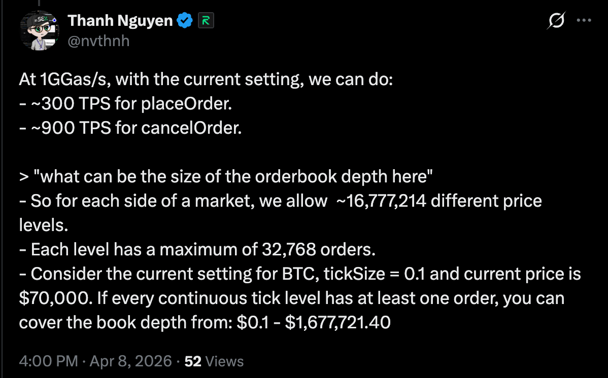

# Section 4｜从过渡 Perps 到三条执行路线

本章共 **26 页**：S4 分隔页、24 页正文、C4 总结页。围绕 Fully Onchain Perps 的目标，先解释 Vault 与混合模式的实现和风险，再展开三条路线的架构、关键技术与代价。本轮明确推荐 L3 作为长期主线，理由是独立演进、业务定制和多业务扩展；保留同条件验证作为落地门槛。P33–P42 原 ID 保留，通过后缀扩页。

| 页面 | 讲述任务 |
| :-- | :-- |
| S4、P33 | 章节入口与三条路线全景 |
| P34、P34A、P35 | Vault 请求执行、单边风险与控制，混合模式的未结算与信任边界 |
| P36、P36A、P36B、P37、P37A | 路线一：容量换算、RISE 流水线/EigenDA、EVM 适配、性能工程与优劣势 |
| P38、P38A、P38B、P39、P39A、P39B | 路线二：双状态机、案例、交互、联合证明、证明实现选择、优劣势 |
| P40、P40A、P40B、P41、P41A–P41D | 路线三：架构与技术、长期收益、三类业务、实验空间及代价 |
| P42、C4 | 同条件比较与 L3 长期推荐的理由和落地门槛 |

主依据是 [原纲 Section 4](../references/chain-infra.mdx) 和用户指定网页的 [本地源稿快照](../references/execution-three-paths-source.mdx)。网页请求未取得正文，本地对应 MDX 已完整读取，不声称与线上最新版完全一致。测量、换算、官方资料与原稿中需要校正的表述见 [本轮核对笔记](../references/perps-execution-routes-evidence.md)。

延续 [Mantle 深色规范](../prompts/Mantle-dark-capital-markets.md)。S4/C4 沿用章节分隔与结论版式。P36–P41 及其所有后缀页，必须将完整路线名称放在大标题上方作为小眉标，不缩写成含义不清的“方案一”。图中 MantleCore、接口、调度与证明组合均为候选设计，不代表已部署。

### S4｜面向 Fully Onchain Perps 的 Chain Infra 演进

**本页要讲什么**

明确本章目标：通过可验证的订单处理、撮合和风险转换实现持续交易。Vault 和混合模式用于较快验证产品，但终态需要更完整的执行与验证能力。三条路线分别把工程工作放在通用 EVM、平行专用状态机、垂直 L3。

**对应原文**

[原纲 4.1–4.3](../references/chain-infra.mdx)，本轮关于分隔页、三路线深入比较及总结的要求。

**需要的图文及原因**

使用统一章节分隔页。三条路线并列，不画成按顺序升级的阶梯；用一条阅读路径连接过渡风险、架构设计、技术代价与选型条件。

**上屏文案**

标题：面向 Fully Onchain Perps 的 Chain Infra 演进

眉标：SECTION 4

主旨：从可验证的订单簿与风险处理出发，决定 Mantle 应怎样扩展执行能力。

本章路径：过渡方案的边界 → 三条路线的架构与技术 → 优劣势和选型条件。

三条路线：优化通用 EVM；平行引入专用状态机；垂直扩展应用 L3。

### P33｜三条路线，分别把交易能力建在哪里

**本页要讲什么**

把路线从抽象名称展开为实际建设方式。路线一借鉴 RISE，以高吞吐和毫秒反馈支撑 EVM 中的订单簿；路线二在 Mantle L2 内加入交易专用状态机，与 EVM 共同完成状态转换并向 Ethereum 证明；路线三独立建设应用执行域，以 Mantle L2 为直接结算层。

**对应原文**

[原纲 4.1、4.3.1–4.3.3](../references/chain-infra.mdx)、[指定设计 §2、§3](../references/execution-three-paths-source.mdx)，以及本轮 RISE、Hyperliquid、Lighter、TradeZone 的参照要求；案例边界见 [核对笔记 §2、§5–7](../references/perps-execution-routes-evidence.md)。

**需要的图文及原因**

三张并列架构卡：单 EVM、同一 L2 双状态机、L3/L2 分层。每张同时给执行位置和改造重点，不能仅用项目 Logo 代替架构。路线一的高性能是需要建设的基础，不是当前 Mantle 已有指标；参考项目的不同安全模型在 P38A 展开。

**上屏文案**

标题：三条路线，分别把交易能力建在哪里

| 路线 | 总体设计 |
| :-- | :-- |
| 1 - 通用 EVM | 借鉴 RISE，以 GGas/s 级容量、Shreds 毫秒反馈和链级优化支撑合约订单簿 |
| 2 - 平行专用状态机 | 在 Mantle L2 内增加原生撮合与风控，与 EVM 共同进入 Ethereum 结算 |
| 3 - 垂直应用 L3 | 独立建设交易执行、数据与证明，以 Mantle L2 为直接结算层 |

三者都要完成可验证撮合；区别是改造位置与长期维护责任。

**讲述补充（不上屏）**

用户所说“把 Perps 刻到 Infra”在路线一落实为围绕交易负载优化流水线、缓存、状态根、提交与资源调度；权威撮合仍由 EVM 合约执行。若把撮合移到独立原生状态机，就进入路线二。RISE 的截图是 1 GGas/s 容量口径，10ms 是开发者文档的快速确认宣传口径，两者不是单块 Gas Limit 和 Ethereum 最终性。

Hyperliquid 提供双执行环境参照，Lighter 提供专用交易状态机与证明参照，TradeZone 提供资产 EVM 与交易环境分工参照。它们不是三套相同的 Ethereum 联合证明实现。L3 需要完整设计适配，但可复用现成 zkVM、数据库与框架。

### P34｜Vault 先用资金池承接交易，作为产品过渡方案

**本页要讲什么**

先解释常见 Oracle/Keeper 型 Vault Perps 的实现：LP 提供资金池，用户提交抵押与订单，Keeper 带价格调用合约，合约检查条件、更新仓位与资金。再说明资金池承担对手方净敞口，单边行情可能侵蚀权益。最后明确本项目用它较快验证需求，而不把它当成可验证订单簿终态。

**对应原文**

[原纲 4.2.1](../references/chain-infra.mdx)；[GMX 架构的 Execution model](https://docs.gmx.io/docs/api/contracts/architecture/)、[流动性与风险文档](https://docs.gmx.io/docs/providing-liquidity/)；[核对笔记 §3、§11](../references/perps-execution-routes-evidence.md)。

**需要的图文及原因**

主图画请求到执行：用户提交保证金与订单，Keeper 将 Oracle 价格和请求交给合约，合约检查价格/风险后更新仓位；另一条 LP→Vault 资金线说明谁承担净损益。风险放在资金池旁作短注，底部突出过渡定位。不要把 Keeper 画成可以任意改账，也不要让本页再次变成只有亏损算例。

**上屏文案**

标题：Vault 先用资金池承接交易，作为产品过渡方案

LP 提供 Vault 资金池，承接交易者的净损益。

用户提交保证金与订单 → Keeper 带 Oracle 价格执行 → 合约校验价格和风险 → 更新仓位，平仓结算。

无需维护高频订单簿，较快验证需求与风控。

风险：未对冲净敞口遇到单边行情，盈利赔付可能耗尽池权益；还需限仓、储备和减仓。

本项目将它作为过渡方案，终态仍是可验证订单簿。

**讲述补充（不上屏）**

这是常见的两阶段 Oracle/Keeper 实现示例，不表示所有池式 Perps 完全同构。用户先提交规模、保证金、可接受价格和执行费；Keeper 提交价格与请求标识，资金和仓位由合约校验及更新。LP 本金与客户保证金属于不同权益，不能混算亏损吸收能力。

保留压力算例供口述：稳定币池 LP 权益 100 万，承接未对冲净多头 500 万，标的上涨 20%，交易者净盈利约 100 万。假定没有减仓、对冲、新增资本或其他损益，LP 权益可能耗尽。净空头客户遇下跌也有对应风险；单边方向本身不足以断言所有 Vault 都亏损。

充分覆盖的库存、按侧 OI 上限、储备、PnL 约束与自动减仓会改变极限。过渡定位来自本项目目标，不是否定所有 Vault 产品的长期经营；更完整的控制与运行可靠性见 P34A。

### P34A｜Vault 可以先验证需求，但要限制风险规模

**本页要讲什么**

把首版的好处和风险控制放在一起。它省去了高频订单簿维护，但没有省去敞口、Oracle、清算、提现和服务恢复。对本项目的可验证订单簿终态，Vault 是过渡产品；这是产品路线选择，不是断言所有池式 Perps 都无法长期经营。

**对应原文**

[原纲 4.2.1 的五类工作](../references/chain-infra.mdx)，[核对笔记 §3](../references/perps-execution-routes-evidence.md)，以及本轮对过渡定位的要求。

**需要的图文及原因**

上方一句首版收益，下方“风险—控制”表，最后给过渡结论。把原有请求、Oracle、Keeper、费用与恢复工作融入对应风险；不把配置了参数等同于消除了风险。

**上屏文案**

标题：Vault 可以先验证需求，但要限制风险规模

优势：无需维护高频订单簿，对于 chain infra 负担较低

| 风险 | 必须补齐 |
| :-- | :-- |
| 净敞口累积 | 限仓、对冲、费用调节与减仓 |
| 错价、休市跳空 | 价格有效期、时段规则与熔断 |
| 清算或 Keeper 停顿 | 执行预算、坏账分摊与恢复 |
| LP 赎回挤压赔付 | 储备与明确的退出约束 |

本项目以它验证需求与风控，再走向可验证订单簿。

**讲述补充（不上屏）**

限仓会限制业务规模，减仓和利润兑现约束会影响持仓体验，动态费用未必在行情跳变前及时平衡方向。小盘股休市、停牌与跳空尤其需要分时段风险规则，不能只沿用全天连续价格假设。

首版仍需查到请求创建、执行、失败或过期；检查价格版本；为 Keeper 设置有界提交、费用与重试预算；保留可重放事件，确保重试不重复执行，并验证开仓、减仓和退出。保留原纲这五项工程要求，不因增加财务风险讨论而删掉运行可靠性。

### P35｜混合模式减轻链负载，也留下撮合与结算风险

**本页要讲什么**

混合模式把高频挂撤与撮合放在链下，降低链上负载并加快前端反馈；代价是撮合服务的权力、可用性以及已成交未结算的风险窗口。解释对应的防护方式，并说明只验证结果不足以满足本章终态。

**对应原文**

[原纲 4.2.2](../references/chain-infra.mdx)、[指定设计 §3.1.3](../references/execution-three-paths-source.mdx)、[核对笔记 §4](../references/perps-execution-routes-evidence.md)。

**需要的图文及原因**

用“链下撮合 → 批量提交 → 链上确认”标出未结算窗口，配四行风险表。撤单回执与链上失效不能合并成同一时间点；风险不是只有吞吐不足，也包括撮合输入和顺序无法核验。

**上屏文案**

标题：混合模式减轻链负载，也留下撮合与结算风险

优势：挂撤单在链下完成，降低 Gas 与链上订单流。

流程：链下撮合 → 批量提交 → 链上确认。

| 风险 | 应对 |
| :-- | :-- |
| 撮合方停机或选择性接单 | 链上取消、故障退出 |
| 成交未结算、保证金重复使用 | 预留资金与积压上限 |
| 撤单后旧单仍被提交 | 版本、截止与累计量校验 |
| 重放或账本分歧 | 成交去重、重放与对账 |

仅验证成交结果，无法证明撮合顺序与订单完整性。

**讲述补充（不上屏）**

链下 API 响应不等于链上成交和可提现。批量压测要同时测成交数、Gas、数据发布量与结算延迟；积压超过阈值需限制新增风险。资金费在哪一层计算、登记依实现说明。

终态要把订单输入承诺、执行顺序和撮合/风险规则纳入验证。即便执行规则被证明，订单在到达权威入口前是否被审查，仍需接纳与强制请求机制处理。不能把“ZK 撮合”说成自动解决全部交易公平性。

### P36｜根据 Rise 的指标，Mantle 很难直接实现 onchain orderbook perps

**本页要讲什么**

以用户提供的 RISE 截图和本次 Mantle RPC 样本量化路线一的改造压力。先正确区分每秒 Gas 容量与单块限制，再按同开销假设换算挂单和撤单吞吐。结论限定为该实现开销下的高频目标，不把预算推算冒充实际订单簿压测。

**对应原文**

[原纲 4.3.1](../references/chain-infra.mdx)；[RISE 截图](../pics/rise-gas-meter.png)；[RPC 样本](../references/mantle-execution-rpc-2026-09-27.json)、[换算与假设 §2](../references/perps-execution-routes-evidence.md)。

**需要的图文及原因**

必须实际放入下图。左侧放大截图中作者、1 GGas/s、placeOrder 300 TPS、cancelOrder 900 TPS 的区域；保留单位、近似符号与“current setting”。价格档数部分不是本页证据重点，可裁出主视区，但保留原图素材。右侧放 Mantle 换算及结论，不能再配一个未经测量的实际 TPS 柱状图。

**上屏文案**

眉标：路线 1 - 在现有 Mantle L2 通用执行环境中实现

标题：根据 Rise 的指标，Mantle 很难直接实现 onchain orderbook perps

RISE 截图：1 GGas/s ≈ 挂单 300/s 或撤单 900/s。

Mantle：60M Gas / 2s = 30 MGas/s，仅为该预算的 3%。

同开销推算：约挂单 9/s 或撤单 27/s，且独占全链预算。

高频订单簿需要大幅性能改造，不能直接照搬。

**讲述补充（不上屏）**

截图作者 Thanh Nguyen，@nvthnh；1 GGas/s 不是“1G Gas Limit”。本次主网链 ID 5000、块 101198173，Gas Limit 60,000,000；前 100 块跨度 200 秒。RPC 只证明参数样本，不证明硬件可长期跑满。

预算等效开销约 3.333M Gas/placeOrder、1.111M Gas/cancelOrder；9 和 27 是各自独占预算的替代情形，不能同时获得。还没有给现货、Oracle、清算、失败、DA 与证明留空间。若每次挂单带来三次撤单，约只支持 4.5 组/秒。

这是基于截图设置和同计量假设的上限推算；不同订单簿、批量方式和计价可能改变单操作开销。准确结论是当前参数不足以照搬该高频方案，不是所有小规模 EVM 订单簿在数学上都不可能。截图的价格档数与每档容量也不能当作实际流动性。

### P36A｜RISE 同时优化执行、回执、存储和 DA

**本页要讲什么**

本页改为解释 RISE 在实际业务流水线各环节公开了哪些优化，不再泛画 Mantle 候选架构。CBP 缩短执行空窗，Shreds 提前反馈，RiseDB 优化状态组织，EigenDA 承担主数据发布路径。结算按其 OP Succinct Lite 挑战式证明描述，与 Mantle 的有效性证明路径分开。

**对应原文**

[原纲 4.3.1](../references/chain-infra.mdx)；RISE 官方 [CBP](https://docs.risechain.com/docs/rise-evm/cbp)、[Shreds](https://docs.risechain.com/docs/rise-evm/shreds)、[RiseDB](https://docs.risechain.com/docs/rise-evm/rise-db)、[DA](https://docs.risechain.com/docs/rise-evm/data-availability)、[ZK Fraud Proofs](https://docs.risechain.com/docs/rise-evm/zk-fraud-proofs)；[本轮核对 §9](../references/perps-execution-routes-evidence.md)。

**需要的图文及原因**

画 RISE 流水线及优化挂点。订单进入 CBP 持续执行，状态根线程与封块并行；执行状态连接 RiseDB；Shreds 向用户返回快速回执。数据主箭头明确指向 EigenDA，虚线回退箭头指向 Ethereum blobs；Ethereum 上的状态结算单独表示，挑战发生时才接 ZK 证明分支。不能把 EigenDA 隐入“数据发布”四字，也不能将快速回执、DA 确认和结算最终性连成同一时间点。

**上屏文案**

眉标：路线 1 - 在现有 Mantle L2 通用执行环境中实现

标题：RISE 同时优化执行、回执、存储和 DA

订单 → CBP 持续执行 EVM 交易、并行算根与封块；Shreds 提前反馈。

RiseDB：统一状态与 Merkle 存储，优化 SSD 读写。

DA：EigenDA 为主；异常回退 Ethereum blobs。

结算：向 Ethereum 提交状态；OP Succinct Lite 在挑战时提供 ZK 证明。

按公开文档整理；快速回执不等于最终性。

**讲述补充（不上屏）**

CBP 文档分别描述预执行线程、算根线程和封块主线程；还修改 pending 回执返回时机，并提供 eth_sendRawTransactionSync。Shreds 按片段广播，不必等整个块完成。文档的 10ms、ping + 1–3ms 等属于特定宣传/环境口径，不是同一轮压测，更不是 L1 最终性。

RiseDB 的公开设计是统一 world state 与 Merkle 存储、减少重复处理，并偏向 SSD 顺序/追加写；不能把它说成直接取消 EVM 的状态认证。EigenDA 异常、没有 ACK 或付款问题可触发 blobs 回退；回退存在不等于运行时没有外部 DA 假设。

这里画的是 RISE 文档描述，不是 Mantle 已采用或决定照搬的安全模型。Mantle 可以借鉴执行与反馈工程，但切换 EigenDA 或挑战式证明应独立评估；不能把 RISE 吞吐直接当作同等 DA/证明条件下的比较结果。

### P36B｜Solidity 撮合不要求新 opcode，性能适配仍然很重

**本页要讲什么**

直接回答 EVM 适配问题。订单簿、匹配和风控可用现有指令实现，难点在应用数据结构和 Gas 成本，以及执行客户端的资源利用。区分不改变规范结果的性能优化、仍属后续计划的 PEVM、引入新原生能力的语义扩展。

**对应原文**

RISE 官方 [CBP](https://docs.risechain.com/docs/rise-evm/cbp)、[PEVM](https://docs.risechain.com/docs/rise-evm/pevm)、[RISEx Overview](https://docs.risechain.com/docs/risex/about/overview)；[核对笔记 §9.2–9.3](../references/perps-execution-routes-evidence.md)。

**需要的图文及原因**

用三层表：Solidity 实现、客户端执行优化、可选原生扩展。每层同时说明怎么做及兼容影响；PEVM 标为文档中的后续项。图中不要用高 Gas 反推没有预编译，也不要把“保持 EVM”误画成没有任何接入差异。

**上屏文案**

眉标：路线 1 - 在现有 Mantle L2 通用执行环境中实现

标题：Solidity 撮合不要求新 opcode，性能适配仍然很重

| 层次 | 需要做什么 |
| :-- | :-- |
| 合约 | 订单索引、紧凑存储、有界批处理与 Gas 控制 |
| 客户端 | 流水线、算根、存储和回执优化 |
| 可选扩展 | 原生撮合预编译需新增执行与证明规则 |

现有 EVM 指令足以表达撮合；性能优化可保留兼容。

PEVM 文档仍标为后续；块上下文与快速回执边界需检查。

**讲述补充（不上屏）**

本身不需要新增 opcode 的结论，来自 Solidity 可在现有 EVM 里表达这些算法；不等于任意实现都能在 Mantle 目标吞吐下运行。位图、树索引、存储打包和批处理是可评估的方法，不冒充已核实的 RISEx 内部代码。不能仅由 Gas 高就断言其生产实现完全没有自定义组件；本轮未完成全客户端审计。

PEVM 提出乐观并行、依赖检查、冲突重执行和 beneficiary 余额 lazy updates，目标是保持顺序执行结果，但文档明确写 not currently live。CBP 的并行算根不能被当成已上线的交易并行；热点订单簿共享状态仍会冲突。

CBP 对依赖尚未算出父块哈希的 BLOCKHASH/EIP-2935 请求有特殊调度，对 L1 origin 切换也有适配。应用可能仍能正确执行，却不能获得相同的快速回执。若另增 opcode/precompile，须同步节点与证明语义，依赖它的合约也需要目标链支持；不表示所有旧 EVM 合约都会因此失效。

### P37｜路线一的工作量贯穿执行、存储和证明

**本页要讲什么**

把“大量性能优化”拆成具体工作包。连续执行解决空窗，缓存和状态根工程降低读写负担，批处理减少重复成本，排序与资源保障处理市场风险，DA/证明承担扩容后的真实负载。热门订单簿依然存在顺序依赖。

**对应原文**

[原纲 4.3.1 六项工作及两项约束](../references/chain-infra.mdx)、[指定设计 §3.1.3–3.1.4](../references/execution-three-paths-source.mdx)。

**需要的图文及原因**

用“环节—怎么做”表，配底部串行约束。正文不重复 P36A 的架构图；具体说清每项优化对象及验收方式，避免只留下“高性能、并行、低延迟”口号。

**上屏文案**

眉标：路线 1 - 在现有 Mantle L2 通用执行环境中实现

标题：路线一的工作量贯穿执行、存储和证明

| 环节 | 怎么做 |
| :-- | :-- |
| 执行反馈 | 连续执行、提前回执、状态订阅 |
| 热点存储 | 缓存、数据库、状态根流水线 |
| 订单提交 | 批量挂撤、验签复用、限流 |
| 风险调度 | 撤单和清算预算、明确优先规则 |
| DA 与证明 | 按订单负载压测，控制积压 |

同一订单簿与共享保证金有顺序依赖；缩短区块不能替代这些工作。

**讲述补充（不上屏）**

另一个必需工作包是同步组合接口：现货成交、Perps 成交与保证金更新要能在同一交易内检查结果并共同回滚，详见 P37A。每种操作需有明确的反滥用规则，不能只声明撤单无限优先。

压测包含高撤单比、批量改单、扫多档、热门市场共享账户、Oracle 更新与批量清算；分别测接收、执行、生效、发布和证明延迟。独立市场可并行不代表一个热点市场可任意并行；提高出块频率也可能增加固定开销。

### P37A｜路线一保留同链组合，代价是全链性能工程

**本页要讲什么**

明确路线一的优势与劣势，并给出适用条件。同链合约与资产复用有价值，但不是免费获得无限吞吐；业务仍与其他应用争用执行、数据和证明资源，低 Gas 单价也不减少真实工作量。

**对应原文**

[原纲 4.3.1](../references/chain-infra.mdx)、[指定设计 §2.1、§3.1](../references/execution-three-paths-source.mdx)，结合 P36–P37 的容量与工程分析。

**需要的图文及原因**

用左右两列“优势/代价”，底部给一条选择条件。组合示例只能画在同笔可同步完成的调用框内，不把挂单成功画成已经对冲成交。

**上屏文案**

眉标：路线 1 - 在现有 Mantle L2 通用执行环境中实现

标题：路线一保留同链组合，代价是全链性能工程

优势：复用 EVM 合约、钱包与资产；现货、借贷和 Perps 有同笔组合空间。

代价：热点订单簿受通用执行成本约束；高频负载争用全链资源，扩容还要带动 DA 与证明。

组合条件：同步成交、返回结果、失败整体回滚；只挂单不等于完成对冲。

适合：同链组合价值高，且愿意承担 RISE 式持续性能工程。

### P38｜双状态机在 Mantle 内协作，共同向 Ethereum 结算

**本页要讲什么**

展示路线二的核心架构：一个 Mantle L2 内并列 EVM 与 MantleCore，前者保留通用资产与 DeFi，后者原生表达订单簿与风险转换。它们共用规范调度、状态承诺和重放边界，再由完整证明路径进入 Ethereum 结算。

**对应原文**

[原纲 4.3.2](../references/chain-infra.mdx)、[指定设计 §2.2.1–2.2.2、§3.2](../references/execution-three-paths-source.mdx)；参考 [HyperCore/HyperEVM](https://hyperliquid.gitbook.io/hyperliquid-docs/hyperevm)，Mantle 的不同验证要求见 [核对笔记 §5–6](../references/perps-execution-routes-evidence.md)。

**需要的图文及原因**

借鉴 HyperCore + HyperEVM 的并列结构，但明确这是 Mantle 的候选架构。最大外框为 Mantle L2；框内顶部放统一调度，中部左 EVM、右 Core，连接 CoreReader 与 CoreWriter；底部放共同状态承诺。两侧必须共同连入 zkVM 证明/聚合，再跨出 L2 边界指向 Ethereum 验证与结算。数据发布作为同一结算路径的输入，不画成 Core 单独向 Mantle EVM“跨链结算”。

**上屏文案**

眉标：路线 2 - 平行引入一个专用交易状态机

标题：双状态机在 Mantle 内协作，共同向 Ethereum 结算

Mantle L2：统一调度。

EVM：资产、现货、借贷 ↔ MantleCore：订单、撮合、保证金、清算。

CoreReader 读快照；CoreWriter 写动作队列。

共同状态承诺 + 可恢复数据 → zkVM 证明 / 聚合 → Ethereum 验证与结算。

关键：证明必须同时覆盖两个状态机及其交互。

**讲述补充（不上屏）**

“平行引入”指架构上增加执行模块，不意味着两侧可以忽略依赖并发写状态。候选实现可在同一客户端进程中运行，但正确性来自规范顺序与证明，不能来自某台机器上的内存共享。

P38B 给出权限、读取版本、动作生效与资金转移的具体答案；P39 给出共同结算的工程实现。Hyperliquid 自身由 HyperBFT 保障，不向 Ethereum 提交这套 Mantle 证明；本图不能冠以其现网架构名称。

### P38A｜三个参照项目，分别解决不同部分的问题

**本页要讲什么**

解释用户列出的 Hyperliquid、Lighter、TradeZone 各自提供什么设计证据。避免把“专用交易引擎”当成相同部署架构，也避免借现有项目暗示双状态机联合 ZK 已是可直接复用的产品。

**对应原文**

[HyperEVM 官方说明](https://hyperliquid.gitbook.io/hyperliquid-docs/hyperevm)、[Lighter 架构](https://docs.lighter.xyz/about-lighter/technical-architecture-lighter-core)、[OKX Exchange OS 白皮书 §3.4](https://web3.okx.com/whitepaper/okx-exchange-os.pdf)；核对见 [§5](../references/perps-execution-routes-evidence.md)。

**需要的图文及原因**

用三行“参考—借鉴—边界”表。保持文字比较，不挪用宣传 TPS 作 Mantle 目标。Lighter 单独标明是专用 Rollup，TradeZone 只陈述白皮书确认的双环境分工。

**上屏文案**

眉标：路线 2 - 平行引入一个专用交易状态机

标题：三个参照项目，分别解决不同部分的问题

| 参考 | 借鉴什么 | 边界 |
| :-- | :-- | :-- |
| Hyperliquid | Core/EVM、读接口与动作队列 | HyperBFT，非 Ethereum ZK 结算 |
| Lighter | 专用交易状态机与证明 | 独立 Rollup，非双引擎 EVM |
| OKX TradeZone | EVM 管资产，交易环境管撮合与风控 | 白皮书描述，不证明联合 zkVM 已成熟 |

Mantle 要补齐的是双状态机共同证明与结算。

### P38B｜读固定快照，写入队列，资金逐阶段交接

**本页要讲什么**

为 P38 原有的具体问题提供答案。采用原稿的阶段式方案作为 PoC：Core 先执行已认可输入，EVM 读其固定快照，EVM 写动作入队，后续 Core 阶段消费。交易权限、资源上限和资产记账一起进入规范，不把共享内存当作资产安全保证。

**对应原文**

[指定设计 §2.2.2–2.2.3、§3.2.2–3.2.3](../references/execution-three-paths-source.mdx)、[原纲 4.3.2](../references/chain-infra.mdx)；[HyperCore 交互文档](https://hyperliquid.gitbook.io/hyperliquid-docs/for-developers/hyperevm/interacting-with-hypercore)。

**需要的图文及原因**

用“问题—本轮设计答案”表和一条资金箭头。CoreReader 明确读固定阶段，CoreWriter 明确延后生效；充值示例用锁定、队列、入账三个状态，不能直接画 EVM 资产与 Core 余额同时可花。

**上屏文案**

眉标：路线 2 - 平行引入一个专用交易状态机

标题：读固定快照，写入队列，资金逐阶段交接

| 问题 | 设计答案 |
| :-- | :-- |
| 谁能操作 | 验签、权限、nonce，提款另授权 |
| 怎样排序 | Core 先执行，EVM 后读取固定快照 |
| 怎样写入 | 成功动作入队，后续 Core 阶段消费 |
| 怎样计费 | 按消息、读写、数据和证明设预算 |

资金：EVM 锁定 → 队列认证 → Core 入账。

此方案跨模块写入异步，不承诺同笔成交回滚。

**讲述补充（不上屏）**

这是建议的基线设计，阶段顺序需固定成规范并压测。Core 处理的是此前已提交动作及本轮按规则接纳的原生请求；不能读后台线程随时改变的快照。成功 EVM 交易的事件可以编码动作，但来源、顺序、唯一 ID、回滚和入队必须被重放和证明覆盖。

EVM 交易回滚不得留下可消费动作；Core 业务拒绝要有失败结果与退款/重试状态。提现反向执行：Core 先扣账，认证释放动作，再在指定 EVM 阶段释放资产。待处理额度不能在两侧同时使用。固定精度、溢出与舍入规则，禁止用本地时钟或随机容器遍历决定共识结果。

### P39｜难点是让两种状态转换都能被 Ethereum 验证

**本页要讲什么**

按用户要求在“实际要做什么”右侧加入“怎么做”。核心工作不止是高速执行器，而是证明 EVM、Core 与跨引擎交互正确，并让 Ethereum 的 Mantle 结算入口认证完整结果。

**对应原文**

[指定设计 §2.2.4、§3.2.3–3.2.4](../references/execution-three-paths-source.mdx)、[原纲 4.3.2](../references/chain-infra.mdx)、[核对笔记 §6](../references/perps-execution-routes-evidence.md)。

**需要的图文及原因**

必须用“工程工作｜实际要做什么｜怎么做”三列表，不只列问题。四行分别覆盖业务、状态承诺、交互一致性和 L1 接受规则。最后一句交给下一页解释 zkVM 与专用电路的不同工程路径。

**上屏文案**

眉标：路线 2 - 平行引入一个专用交易状态机

标题：难点是让两种状态转换都能被 Ethereum 验证

| 工程工作 | 实际要做什么 | 怎么做 |
| :-- | :-- | :-- |
| 业务验证 | 覆盖 EVM 与 Core | 扩展 Guest，校验撮合和风险 |
| 状态承诺 | 认证两侧和队列 | 保留 EVM 根，扩展结算输出 |
| 交互一致 | 读对快照、资金守恒 | 验证见证、入队消费与扣账 |
| L1 接受 | 拒绝错误版本或前态 | 绑定公开输入，更新密钥与配置 |

新增证明逻辑是必需工作；电路实现方式另选。

**讲述补充（不上屏）**

Guest 是在 zkVM 中被证明执行的程序。必须验证 Core 规则、EVM 规则、认证父链输入、CoreReader 快照来源、CoreWriter 成功入队和后续消费。未经认证的宿主机内存读取不能直接充当可信见证。

不能简单用 `hash(CoreRoot,EVMRoot)` 覆盖 EVM 区块头 stateRoot 并认为 RPC/账户证明仍自然兼容。应保留 EVM 状态根语义，在扩展的 Mantle 结算承诺中绑定 Core 根、队列根、前后态、批次、父链输入与程序版本。

Ethereum 验证的是完整状态转换的证明与公开输入，不需要 L1 节点逐笔重跑撮合。执行客户端、派生/重放、证明 Guest、聚合程序、L1 密钥或接受配置必须一致。是否修改通用 Verifier 字节码取决于接口和证明体系，不能机械要求每次业务升级都重写通用验证器。

### P39A｜先选证明结构，再决定是否做专用电路

**本页要讲什么**

把工程难点说实，同时校正“非 EVM 状态机必然需要手写电路”。既可以在 SP1 联合 Guest 中证明复合状态，也可以对 EVM/Core 分开证明后聚合；若性能不达标，再评估 Core 专用电路或加速组件。所有路径都需证明跨引擎通信，不是简单拼接两份证明。

**对应原文**

[指定设计 §3.2.1、§3.2.4](../references/execution-three-paths-source.mdx)、[SP1 官方介绍](https://docs.succinct.xyz/docs/sp1/introduction)、[核对笔记 §6](../references/perps-execution-routes-evidence.md)。

**需要的图文及原因**

画两条候选证明流水线汇入同一个 Ethereum 结算出口：联合 Guest；EVM/Core 各自证明后校验交互并聚合。专用电路作为第二种后端选择或优化分支，不画成 zkVM 之前的强制步骤。用一个短句说明即使本机撮合快，证明也可能成为瓶颈。

**上屏文案**

眉标：路线 2 - 平行引入一个专用交易状态机

标题：先选证明结构，再决定是否做专用电路

方案 A：EVM + Core + 交互规则 → 联合 zkVM Guest → Ethereum。

方案 B：EVM 证明 + Core 证明 → 交互校验与聚合 → Ethereum。

SP1 可证明 Rust 程序，不要求每项业务手写电路。

若证明成本不达标，再投入 Core 专用电路或加速组件，并审计新增约束。

原生执行快，不代表证明跟得上。

**讲述补充（不上屏）**

两路证明必须认证相同批次、前后态、阶段快照和消息承诺，聚合层拒绝不匹配输入。两份各自有效的证明并不自动证明资产跨模块守恒。

按最坏订单与清算路径测量 zkVM cycles、见证生成、内存、证明延迟、单位成本及积压恢复。必要时定制哈希、密码学或状态验证加速；选择专用证明后端时，则需要额外电路实现、递归/包装兼容与安全审计。这里不能预设固定 5–10 倍成本或不可行结论。

### P39B｜专用引擎换来效率，也进入了 Mantle 核心维护范围

**本页要讲什么**

明确路线二的收益与代价：定制交易数据结构、紧密读取 EVM/Core 状态、无需新增 L3 结算域；同时承担核心客户端、双状态、证明、升级与故障影响。基线是异步动作队列，不能在优势里又无条件承诺同步原子组合。

**对应原文**

[指定设计 §2.2.4、§3.2](../references/execution-three-paths-source.mdx)、[原纲 4.3.2](../references/chain-infra.mdx)，承接 P38–P39A。

**需要的图文及原因**

左右两列优势和代价，底部给适用条件。统一状态边界旁边保留队列/证明维护提示，不使用“零风险、完美组合、免费同步”的图标。

**上屏文案**

眉标：路线 2 - 平行引入一个专用交易状态机

标题：专用引擎换来效率，也进入了 Mantle 核心维护范围

优势：按订单与风控定制执行；与 EVM 紧密交互，依然保留了 DeFi 可组合性。

代价：双状态与队列、联合证明、全链升级和节点运维；故障可能影响共享执行与证明资源。

当前设计：同步读快照、异步写动作；资产记账仍须审计。

适合：专用执行与同域协作价值高，团队能长期维护核心客户端和证明。

### P40｜L3 承担专用执行，Mantle L2 成为直接结算层

**本页要讲什么**

给出垂直扩展的 high-level 设计。Perps L3 独立处理订单、仓位和风控；用户先在 Mantle 分配资金，L3 提交数据与证明给 L2，L2 接受状态及提现权。Mantle 自身再向 Ethereum 结算，两层确认必须分开。

**对应原文**

[原纲 4.3.3](../references/chain-infra.mdx)、[指定设计 §2.3.1–2.3.2、§3.3](../references/execution-three-paths-source.mdx)、[核对笔记 §7](../references/perps-execution-routes-evidence.md)。

**需要的图文及原因**

使用三层竖向图：上层 Ethereum，中层 Mantle L2 结算合约，下层 Perps L3。L3→L2 标“数据与证明”，L2→L3 标“认证充值”，L2→用户标“已验证提现”；Mantle→Ethereum 是另一段父链结算。不能让 L3 证明箭头绕过 Mantle 直接指向 Ethereum。

**上屏文案**

眉标：路线 3 - 垂直扩展 app-specific L3

标题：L3 承担专用执行，Mantle L2 成为直接结算层

Ethereum：验证 Mantle 状态。

Mantle L2：资产托管、消息、L3 状态验证与退出。

Perps L3：独立排序、撮合、保证金、清算与证明。

路径：认证充值向下；数据与证明向上；已验证提现回到 L2。

L3 不逐单调用 L2。必须设计完整应用执行域，但可复用 zkVM、数据库与基础框架。

**讲述补充（不上屏）**

Lighter 可作为专用执行与父链结算的架构参照，但将 Ethereum 父链角色换成 Mantle，需要重新适配 DA、验证调用、确认与消息语义，不能只换 RPC。

L3 可采用 EVM 或专用状态机。本轮重点评估原生交易状态机，以按需实现业务和状态结构。用户预先分配保证金后可连续本地交易；盈利须对应真实负债变化，不可凭任意 PnL 数字在父链创造资产。

### P40A｜Mantle L2 如何提供结算能力（参考 OP Stack 的实现）

**本页要讲什么**

说明 Mantle L2 不是仅提供一个验证器地址。托管归属、消息真实性、连续状态、提现兑付、异常退出与升级权限共同构成结算层。每一条 L3 都必须有清楚的资产与版本边界。参考 OP Stack 的父链消息与状态接受分工，下表是本方案的职责归纳，不表示六个名称都是可直接部署的同名 OP Stack 合约。

**对应原文**

[指定设计 §2.3.2 的 L2 组件表、§3.3.2](../references/execution-three-paths-source.mdx)、[原纲 4.3.3](../references/chain-infra.mdx)。

**需要的图文及原因**

用六个组件围绕“L3 状态接受”组织，逐项写职责。组件名称与职责都在上屏表内；底部用一句约束防止把一条 L3 的证明跨域用于其他资产。

**上屏文案**

眉标：路线 3 - 垂直扩展 app-specific L3

标题：Mantle L2 如何提供结算能力（参考 OP Stack 的实现）

| 组件 | 职责 |
| :-- | :-- |
| Escrow | 按 L3 隔离资产与兑付额度 |
| Inbox | 认证充值和强制请求 |
| Registry | 记录状态根、批次和版本 |
| Verifier | 检查证明及绑定的公开输入 |
| Outbox | 验证提款，生成待领余额 |
| Exit / Upgrade | 处理停机、退出和迁移 |

证明须绑定应用、父链、前后态与消息；一条 L3 不能提走另一条的资产。

**讲述补充（不上屏）**

至少绑定 parentChainId、l3Id、settlementContract、程序/验证密钥版本、前后状态根、批次、认可的父链引用、Inbox 游标、提款和数据承诺。不能只让 Observer 声称“看到了充值”，合约和证明必须拒绝伪造历史与重复消费。

隔离 Escrow 不自动隔离共享管理员、Verifier 或跨链授信的风险。初期按 L3 分配额度，不默认跨 L3 统一保证金和损失担保。升级也不能绕过资产归属与退出约束。

### P40B｜L3 要交付从接单到提款的完整运行时

**本页要讲什么**

让“从头设计和适配”具体化：除了撮合程序，还要有父链观察、持久化重放、批次发布、证明、API 和运维。用资金生命周期串起来，显示高速交易依赖哪些已认证状态。

**对应原文**

[指定设计 §2.3.2 的 L3 组件与通信流程、§3.3.3](../references/execution-three-paths-source.mdx)、[原纲 4.3.3](../references/chain-infra.mdx)。

**需要的图文及原因**

上方三条运行管线，下方充值到提款流程。API 的暂定回执与 L2 认可结果用不同视觉状态，不能在收到订单时就画成已可提款。全部组件使用下方短标签。

**上屏文案**

眉标：路线 3 - 垂直扩展 app-specific L3

标题：L3 要交付从接单到提款的完整运行时

交易：网关 / API → 验签排序 → 撮合与风险 → 暂定回执。

数据：父链观察 → 状态存储、快照与重放 → 批次和 DA 发布。

验证：见证生成 → 证明 → L2 接受状态。

资金：L2 锁定 → L3 入账交易 → L3 扣账提款 → L2 验证后领取。

补齐 Indexer、SDK、监控与故障切换；每次消息只消费一次。

**讲述补充（不上屏）**

充值只在认可的父链历史上入账，并保存重组依赖。订单执行要持续检查保证金与风险，不能等批次结算时才发现破产。提款扣账与 Outbox 承诺绑定，L2 验证后建立待领余额；重复执行和超额领取失败，付款失败保留可重试权或原子回退。

L3 状态机需定义定点精度、撮合顺序、价格输入、部分成交、费用、资金费和坏账规则。可复用成熟库和节点框架，但复用不能省掉业务规则验证、兼容测试和运维责任。

### P41｜数据、证明和退出决定 L3 是否真正可用

**本页要讲什么**

展开 L3 最容易被快速撮合指标遮住的技术风险。数据能否恢复、父链重组怎样处理、证明积压怎样降级、开放仓位怎样退出，都影响用户资产安全。L2 托管本身不能替代这些机制。

**对应原文**

[指定设计 §3.3.2–3.3.4](../references/execution-three-paths-source.mdx)、[原纲 4.3.3](../references/chain-infra.mdx)、[核对笔记 §7](../references/perps-execution-routes-evidence.md)。

**需要的图文及原因**

用四行“技术问题—首期设计”，底部解释三层确认。退出行必须包含开放仓位处置，不能只放资产余额证明图。DA 路径标为首期候选，不把 Alt DA 或 L2 Blob 支持当作默认事实。

**上屏文案**

眉标：路线 3 - 垂直扩展 app-specific L3

标题：数据、证明和退出决定 L3 是否真正可用

| 问题 | 首期设计 |
| :-- | :-- |
| 数据可恢复 | 评估 L2 calldata，提供归档与重放 |
| 父链重组 | 绑定确认历史，回退并重放依赖 |
| 证明积压 | 限制开新风险，优先减仓与恢复 |
| 排序器失效 | 强制请求，超时进入结算退出 |

开放仓位须按规则估值、处理坏账后退出，不能只凭余额抽走抵押品。

区分 L3 回执、L2 接受与 Ethereum 最终确认。

**讲述补充（不上屏）**

DA 必须提供足以重建状态与退出的数据，并明确承诺、保存期限和数据不可得时的停止规则。首期只选一条数据路径；使用 Alt DA 时需单列可用性假设和恢复责任，不宣称安全模型不变，也不默认 Mantle 支持 L1 式 Blob 交易。

故障模式覆盖 Sequencer、Prover、DA、Oracle、父链和升级。开放 Perps 仓位的异常退出需确定冻结状态、撤单、最终估值/平仓规则、坏账分摊与索赔顺序。快提款或 Solver 垫资另有资本和风险条件，不能作为默认退出保障。

### P41A｜推荐 L3：让 Mantle 成为多业务的资产与结算平台

**本页要讲什么**

正面说明本次长期推荐的理由。L3 的价值不只在交易快，而在于将稳定的资产/结算层与可定制的业务执行层分开：业务迭代、账户、排序、资源和成本策略可以分别演进，后续新业务复用同一结算基础。此页集中 pitch，三类业务、实验空间与代价分到后续页讲清。

**对应原文**

本轮用户明确的 L3 长期方向；[指定设计 §2.3.3 该设计的优劣势分析](../references/execution-three-paths-source.mdx)、[原纲 4.3.3](../references/chain-infra.mdx)；[完整收益归纳 §10](../references/perps-execution-routes-evidence.md)。

**需要的图文及原因**

上方用一句平台定位，下方六张收益卡，覆盖原稿的升级、执行、排序/准入、账户/费用、资源隔离、成本和生态扩展。不要让风险列占掉本页一半，代价在 P41D 单独呈现。所有收益使用具体动作，不用无证据的性能倍数或营收预测。

**上屏文案**

眉标：路线 3 - 垂直扩展 app-specific L3

标题：让 Mantle 成为多业务的资产与结算平台

保留之前的升级节奏，根据 Ethereum hardfork 以及 Mantle feature hardfork 的情况进行升级，但是不受限具体业务 L3 的而升级

- 与合约 dapps 相比
  - 不同的 appchain 可以定制化实现，包括排序规则，不同的账户模型，不同的 gas token，甚至可以审查用户的交易
  - 不同的 appchain 可以做到极致精简的状态机设置，抛弃通用的 EVM bytecodes 解释器，放弃 MPT 状态树
  - 不同的 appchain 之间有天然的拥堵隔离，起到 LFM 的作用
  - Appchain 的手续费可以进一步下降（因为我们可以选择 alt DA）

**讲述补充（不上屏）**

原生状态机可去掉不需要的 EVM 字节码解释与 MPT 数据组织，改用适合订单或隐私业务的结构，但仍需认证状态、证明和恢复。排序与准入可以按产品选择，其政策、风险通道及退出规则必须清楚。

独立业务发布减少每次产品变动都修改 Mantle 核心的压力，不代表 L2 永远无需配合 Verifier 或消息版本升级。执行预算分离可缓解业务间拥堵传播，但共享 DA/结算仍有依赖；不同计费机制也不自动等于单链 LFM。

降费是具体优化空间，最终比较执行、DA、证明和固定运营总费。Alt DA 是可选安全模型，不是无条件更低成本。平台定位是产品与架构方向，不直接推出用户增长、收入或流动性已经统一。

### P41B｜同一结算基础，可以扩展三类业务 L3

**本页要讲什么**

用具体技术收益说明三类业务的扩展价值。Perps 按订单与风控定制；Meme Launchpad 可依据短生命周期业务设计更激进的过期与冷热分层，缓解活跃状态膨胀；Private L3 可借鉴 Commonware 公布的 Bonsai 隐私支付原型，以紧凑账户状态和批量证明验证降低存储及验证负担。重点放在业务收益与现有研究证据。

**对应原文**

本轮用户对 Launchpad 剪枝与 Commonware 的要求；[指定设计 §2.3.2–2.3.3](../references/execution-three-paths-source.mdx)；[Commonware：Private Payments](https://commonware.xyz/blogs/private-payments)、[公开原型 PR](https://github.com/guruvamsi-policharla/zk-pari/pull/2)、[EIP-7736](https://eips.ethereum.org/EIPS/eip-7736)；原型、基准口径及与历史过期的区别见 [核对笔记 §12](../references/perps-execution-routes-evidence.md)。

**需要的图文及原因**

用三张业务卡分配信息：Perps 一句带过，Launchpad 和 Private 占主区域。Launchpad 图示过期记录离开热状态、权益承诺保留；Private 卡标出 Bonsai 原型、32B/账户和验证吞吐。百万级数字旁必须直接显示硬件与“非整链 TPS”，不能只用很小的脚注纠正大标题中的性能口径。EIP-7736 作为设计参照，不能画成已经部署的 L1 功能。

**上屏文案**

眉标：路线 3 - 垂直扩展 app-specific L3

标题：同一结算基础，可以扩展三类业务 L3

Perps L3：专用撮合、保证金与清算。

Meme Launchpad L3：过期记录激进剪枝、移出热状态，压低节点存储，保留权益承诺；可借鉴 EIP-7736。

Private L3：参考 Commonware Bonsai 原型，隐藏金额与对手方，验证者每账户存 32B 承诺。

Bonsai：18 核 M5 批量证明验证约 1.05M tx/s。

**讲述补充（不上屏）**

Launchpad 的提案重点是缩小验证节点必须长期维护的热状态，既可清理已结束、无残余权利的请求/订单，也可把长期不活跃状态转入保留承诺与恢复路径的冷层。过期判定、终态、未完成退款、LP 领取、余额、防重放及跨层毕业状态必须分开处理，不能按币龄或固定 48 小时删除有效资产。归档、数据可用性、用户恢复证明和异常退出必须持续可用。

Ethereum 对应的状态过期研究是 EIP-7736（Leaf-level state expiry in verkle trees），本次正文标为 Stagnant，保留承诺并设计恢复交易。它依赖 Verkle 结构，不能原样当作 Mantle L3 的通用插件；可借鉴的是冷状态移出热存储、保留认证与恢复的思路。EIP-4444/7927 讨论历史数据过期，不解决当前业务状态膨胀；现有证据不足以把这些研究概括为“没有受到重视”。

Commonware 文章链接的是 Bonsai/zk-pari 隐私支付与证明原型，不是已经交付的完整 Private L3 客户端。文中基准为 M5 MacBook Pro（6 性能核 + 12 能效核，48GB RAM）的 18 线程批量验证，报告 1,051,487 操作/秒；send 和 receive 各算一次，按两步支付折算约 52.5 万支付/秒的验证量。测试排除序列化、反序列化与 subgroup checks；不能当作钱包生成证明、网络共识、持久化和父链结算的端到端吞吐。

每账户 32B 是验证者的账户承诺，还有少量哈希等状态；钱包与冷归档并非零存储。该方案隐藏金额、对手方及操作类型，但公开哪个账户活动。现有原型为隐私支付提供具体参照，隐私交易程序与 Mantle 充提、DA、证明结算仍需适配。

### P41C｜账户与跨域交互，可以在 L3 独立试验

**本页要讲什么**

覆盖原稿中实验性功能与互操作的想象空间：账户和费用体验不必等待 L1 选择同一方案；跨 L3 资金调动可以研究意图、快速确认与排序协作。明确这是可独立试验的空间，不能把 FCR、Based Rollups 和 ERC-7683 当成已经打通流动性的万能组合。

**对应原文**

[指定设计 §2.3.3](../references/execution-three-paths-source.mdx) 的 Agentic Native AA 与 FCR/Based/7683；[L3 设计勘误 §7](../../0-narrative/09-native-l3-architecture-and-errata.md)、[核对笔记 §10](../references/perps-execution-routes-evidence.md)。

**需要的图文及原因**

用账户、交互、确认三张研究方向卡，连到“L3 验证 → 复用成熟接口”的路径。术语旁必须有中文目的说明；箭头只表示研究和演进，不把候选方案画成已部署跨域原子执行。

**上屏文案**

眉标：路线 3 - 垂直扩展 app-specific L3

标题：账户与跨域交互，可以在 L3 独立试验

- 账户：试验原生 Agent 授权、多任务 nonce、代付和费用资产。
- 交互：研究 ERC-7683 意图与 Solver，改善跨 L3 资金调动。
- 确认：研究 FCR 快速确认规则、Based 排序与跨域协调。

新功能先在 L3 验证，减少对 L2 EVM 兼容和升级节奏的牵动。

这些是研究空间，不等于已实现原子跨域交易或统一余额。

**讲述补充（不上屏）**

原生 AA 和费用模型仍需实现、证明和安全测试；不是把未定规范直接打开就能用。成熟能力可以通过统一 SDK 和标准接口复用，而不是每个 L3 重建全部用户接入。

FCR 有具体共识与同步性前提，不直接改写 Ethereum FFG 最终性，也不能无条件搬到任意 L3。Based 排序需定义父链及排序者角色、预确认与失败处理。ERC-7683 定义意图互操作接口，Solver 承担资本、履约验证和重组风险；三者均不自动提供跨层同步调用。

业务可独立实验，不代表桥、托管、消息和结算接口可忽略兼容。跨 L3 统一保证金还会连接风险，需与基础独立资金方案分开评估。

### P41D｜L3 的收益需要用跨层安全和完整运维兑现

**本页要讲什么**

在完整 pitch 后集中讲代价，覆盖用户原稿明确提到的跨链风险和流动性碎片化，以及新增证明、数据和退出责任。用具体建设工作回应这些问题，让长期推荐有可执行的落地条件。

**对应原文**

[指定设计 §2.3.3 缺点、§3.3.2–3.3.4](../references/execution-three-paths-source.mdx)、[原纲 4.3.3](../references/chain-infra.mdx)、[核对笔记 §10.2](../references/perps-execution-routes-evidence.md)。

**需要的图文及原因**

用“代价—必须交付”表。资金分配与异步交互单列，避免将 Solver 或意图当成风险已经消失；结尾给从首条 L3 到后续业务复制的验收条件。

**上屏文案**

眉标：路线 3 - 垂直扩展 app-specific L3

标题：L3 的收益需要用跨层安全和完整运维兑现

| 代价 | 必须交付 |
| :-- | :-- |
| 消息与桥接风险 | 来源认证、资产守恒、防重放与退出 |
| 流动性分配 | 充提、再平衡；垫资另计资本风险 |
| 跨层默认异步 | 明确生效、失败补偿和恢复 |
| 独立链成本 | DA、证明、节点、审计与值班 |

先用一条 L3 验证负载、总成本及故障退出，再扩展业务。

保留长期推荐，同时把落地门槛做实。

**讲述补充（不上屏）**

执行隔离不等于桥、共享治理、Verifier 或父链风险全部隔离；独立 Escrow 也不能抵消无上限的共同担保。跨 L3 借贷和统一保证金一旦加入，需重新定义损失承担。

降低费用应计算固定成本摊销和证明/DA/父链费用，不能只比较用户 Gas。L3 内仍可按自身规则组合，但跨 L2 默认异步；快速垫资是带资本风险的服务，不应伪装成原生即时最终性。

### P42｜比较三条路线，要把收益与新增责任放在一起

**本页要讲什么**

按同一组维度比较三条路线。避免只比较原生执行耗时，忽略证明、组合条件和运维责任；也不能用“兼容、可扩展”等词代替可验收的能力。表格应能支持下一页的有条件结论。

**对应原文**

[原纲 4.1、4.3](../references/chain-infra.mdx)、[指定设计 §2、§3](../references/execution-three-paths-source.mdx)，综合本章三组优劣势页。

**需要的图文及原因**

用三路线同维度矩阵，至少包括收益、工程代价、与 L2 组合和验证归属。不要打未经测量的性能星级，不复用源稿早期固定毫秒排名。底部给共同验收负载。

**上屏文案**

标题：比较三条路线，要把收益与新增责任放在一起

| 维度 | 通用 EVM | 平行 Core | 垂直 L3 |
| :-- | :-- | :-- | :-- |
| 主要收益 | 合约与同链组合 | 专用执行、紧密协作 | 定制与独立发布 |
| 最大工作 | 全链性能工程 | 双状态及联合证明 | 完整子链与跨层协议 |
| L2 组合 | 同步成交才原子 | 基线读同步、写入队 | 默认异步 |
| 业务扩展 | 继续增加合约 | 扩展核心模块 | 按业务接入新 L3 |
| 结算 | Mantle → Ethereum | 两状态共同 → Ethereum | L3 → Mantle → Ethereum |

同测挂撤、清算、DA、证明积压与故障退出。

### C4｜近期用过渡产品验证需求，长期以 L3 扩展业务

**本页要讲什么**

收束本轮明确的推荐：近期用 Vault 或混合模式验证需求和风控，长期优先推进 L3，以定制执行、独立演进和多业务扩展承接增长。用三条路线的对照解释为什么推荐，而非仅重列选项；同时把具体实现选择建立在首条 L3 的成本、安全与退出验证上。

**对应原文**

本轮用户补充的 L3 长期方向；[指定设计 §2.3.3](../references/execution-three-paths-source.mdx)、[原纲 4.1–4.3](../references/chain-infra.mdx)。本章依据为过渡方案 P34–P35、路线比较 P36–P41，以及 P41A–P41D 的完整推荐论据。

**需要的图文及原因**

用近期与长期两段路线，长期连向 Perps、Launchpad、Private 三类候选业务；底部列落地验收。结论明确推荐 L3，不再以无方向的三选一结束；也不把三条业务链画成已经获批或同时建设的计划。

**上屏文案**

标题：近期用过渡产品验证需求，长期以 L3 扩展业务

近期：用 Vault 或混合模式验证需求，管住敞口、结算和退出风险。

长期推荐 L3：Mantle 留住资产与结算，专用业务独立演进，减少反复改造 L2 核心。

扩展方向：Perps L3、Meme Launchpad L3、Private L3。

先跑通一条，再复用结算与工具；用真实负载、总成本、跨层安全和故障退出验收。

**讲述补充（不上屏）**

推荐理由来自独立升级、业务定制、资源与费用策略、多业务扩展及实验空间，不只来自单项吞吐。这里明确路线建议，具体 DA、账户、证明后端及部署顺序仍需验证。

若业务要求同笔完成 L2 现货与 Perps 对冲，L3 默认异步的限制仍然存在，应调整产品流程或单独比较同域方案，不以 pitch 抹去边界。执行回执、业务生效、证明接受和可退出时间分别验收；不同时承诺三条链的工期或收益。
